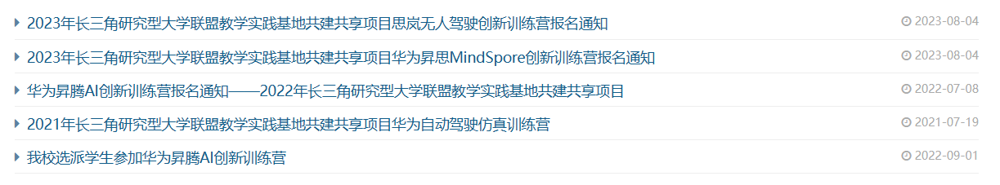

# 长三角研究型大学联盟教学实践基地共建共享项目

#### 项目背景：

本项目是由上海交通大学与企业合办。时间位于暑假且总时长不超过一周的**免费**线下训练营，每年7-8月份在教务处的官网上都会发布报名通知，有愿意在业余时间开阔眼界、获得项目经历的同学可以关注一下。

**方法论：关注教务处信息通知板块，每年暑期会发布相关报名通知**



<figure><figcaption></figcaption></figure>

#### 项目介绍

由于该项目有不同的子项目，在此仅介绍华为昇腾AI创新训练营：本项目由华为昇腾团队举办，一开始会采用线上上课的方式让大家学习华为公司开发的mindspore AI框架与神经网络的基本知识，并在完成学习后开展为期五天的线下训练营。在此期间该项目会组织参与人员三人组队，在五天的时间内使用mindspore AI框架完成一个深度学习的小项目并参与最终答辩，具体课题由大家自由选择，有做图像分类的，有做渲染图片的，也有做强化学习的。在这五天中也会穿插一些小活动以及一些华为公司设计的互动游戏，比如我们当时在训练营的第三天被分成了几个小组，每个小组有8-10个人，每个小组将要在规定的时间内设计一款与华为昇腾相关的产品（类似于头脑风暴），并制作好PPT参与答辩去跟评委拉投资（评委就是从各个小组挑的几个同学），介绍自己产品的好处balabala，前几名会有比较不错的奖品（音箱，书包这些）。

#### 个人收获

如果是先前并没有AI项目经历，希望通过该项目入门深度学习的低年级同学，主要是大一，大二的学生，并且暑期有额外时间去参加活动的，这个项目感兴趣的话可以尝试一下。主要可以感受一下团队合作项目的过程，也能认识一大批其他高校的同学。对于高年级的，暑期已经找到实习并对AI有一定基础的同学就没有必要将时间放在这里，可以把更多精力focus到自己正在做的项目中。
