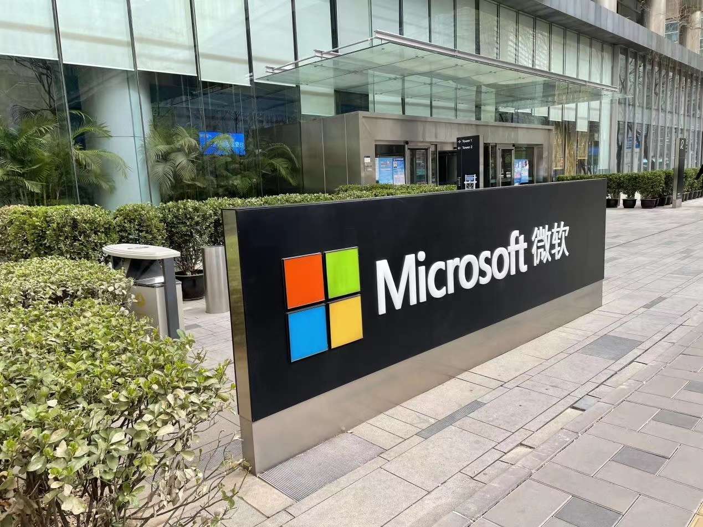

# 微软亚洲研究院项目

## 背景介绍

微软亚洲研究院（简称MSRA）位于北京中关村，是世界顶尖的AI研究机构。包括李开复、何恺明、汤晓鸥、孙剑等世界著名AI科学家都在此工作或实习过，并产出了无数重量级的工作。

<figure><figcaption>
微软大楼
</figcaption></figure>

**每年科大都会有很多同学进入msra攻读联培博士项目或是在msra实习**，msra具有极好的科研资源（人手两块A100）和自由的科研氛围，建议有志于科研的同学千万不要忽视这个机会。

## 方法论

* 有意向**申请msra联培博士项目**或是**进入msra实习**或是**白嫖项目经历**的同学可以关注每年科大与msra的联培项目。**值得注意的是，由于考核方式就是做项目，所以无论过不过都能得到一个完整的科研经历，而且即使没申请到联培博士项目也有很大机会获得大四在msra的实习机会。**2023年报名时间为（2023年2月27日至2023年4月9日），2023版文件如下，**建议仔细研究**：



* 通过msra官方渠道申请，这种方式较为灵活，但是由于官方渠道面向全社会，相对于第一个校企直接对接的机会可能更加难进一些。关注微软亚洲研究院公众号，公众号会发布实习招聘的相关信息：



* 保研后通过导师内推直接进入，有一些导师会主动推学生去msra，这种方式付出成本最小，但是需要导师有相关的connection，但一个缺点是导师内推进去，msra的mentor让你做的项目可能并不是你喜欢的，**所以自由度较低，不如自己申请有较大选择权。**

