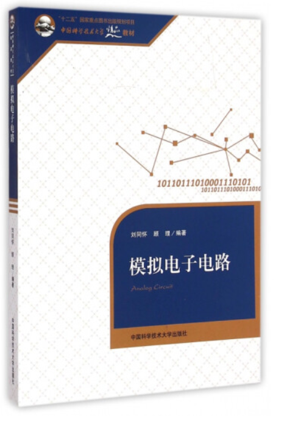

# 电子线路（专业选修）

<figure><figcaption>
课程教材
</figcaption></figure>

## 课程简介

本课程从电路基本概念、原理及分析方法入手，首先介绍基本的电路类型，等效电路，基尔霍夫定律分析方法。然后介绍PN结正向以及反向的应用，这是整本书所有内容的基础，后续所有二极管三极管的内容均在此基础上进行。然后介绍晶体管小信号分析（几种等效电路的分析），差动放大电路，负反馈电路，电流源电路，集成运算放大电路，功率放大电路，信号发生电路，数字逻辑电路等。

## 前置知识涉及的课程

无

## 往年经验

这门课俗称模电，不要当作一门水课！这门课目前开课老师为顾里以及陆伟老师，顾里老师无课后作业。期末前会适当复习一些期末考试内容，课堂较为轻松，给分较好。陆伟老师是传统的授课方式。这门课学习时建议按部就班，书后的课后习题要按时完成，可以参考陆伟老师班的课后作业。这门课是一个循序加深的过程，前面没有打牢基础的话，后面很难进行，也就是说这门课不适合后期突击，很难的啦。视频教程可以参考上交郑益慧老师的课程，b站即有，习题集有童诗白的习题集。这门课的核心内容以及题型、不同习题集大同小异，主要还是要弄明白基本的电路类型以及掌握等效电路的分析方法。

## 与后续课程的联系

此课程为信号与信息处理方向的课程，与此方向其他课程关系较大。

## 目录

电子线路教学大纲

等效电路

深度负反馈电路

数字逻辑电路

