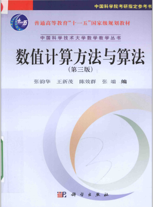

# 计算方法（专业基础）

<figure><figcaption></figcaption></figure>

## 课程简介

此课程目的是使学生学习并掌握现代科学计算中常用的数值计算方法及其算法的原理。教材涵盖了计算方法最基本的内容，包括如何使用计算机编程来计算误差、插值、曲线拟合的最小二乘法、非线性方程求解、解线性方程组的直接法和迭代法、数值微分和数值积分、常微分方程数值解、计算矩阵的特征值和特征向量等，各个章节较为独立，零碎知识点较多。学生需要完成程序作业和书面作业，并且熟练掌握各种方法的计算步骤和证明。

## 前置知识涉及的课程

数学分析，线性代数

## 往年经验

该课程需要完成程序作业，每个作业难度不大，但是可以事先搞清楚老师是否明确要求用什么编程语言（若未要求推荐matlab或python，可以减少代码量）。本课程一般而言只有期末考试且是闭卷，由于知识点零碎并且无明确重点（即每个都是重点，都有可能考），故在平时即需要有意识地去记计算步骤，在学习过程中也不应该轻视方法的证明步骤，课后可以多花时间去理解。考试复习时往年试卷有一定参考价值，但值得注意的一点是2022年春季学期考试与往年不同，其强化了证明题的考查（甚至有书上的原证明）。**如果学有余力本课程可以考虑大二秋季学期修读。**

## 与后续课程的联系

计算方法中涉及的一些算法会在后续的机器学习概论、运筹学中找到应用

## 课程资源



## 目录

计算方法教学大纲

插值

最小二乘拟合

非线性方程求根

解线性方程组的直接法

解线性方程组的迭代法

计算矩阵的特征值和特征向量

常微分方程数值解

