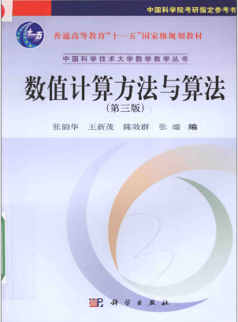

# 计算方法（专业基础）

<figure><figcaption></figcaption></figure>

> 壳子们悟起来吧！!

## 课程简介

如果说线性代数/数学分析等课程，给大家提供了优雅的公式来解决问题，那么计算方法就给大家提供了“丑陋”的方法来解决公式的计算。

举一个简单的例子， 我们都知道椭圆积分是不能用基本函数来表达的，但是这个积分无疑问是收敛的， 如何求解这个值就是计算方法的任务。

计算方法大致可以分为几个部分：函数插值， 非线性方程组求解，线性方程组求解，数值积分/微分，常微分方程求解，矩阵特征值特征向量，线性规划等。

课程有两个主要的特点：关注的问题大部分是之前课程学过的，使用的方法尽量是计算机可以使用的。“计算”二字更加侧重于计算机的计算。从这个角度看，计算方法这门课还是挺有意义。

## 前置知识涉及的课程

数学分析，线性代数

## 往年经验

本课程上课涉及到很多证明，平时书面作业的计算量非常大，同时会附带一些编程作业。考试也是以计算为主，附带一些证明。因此考前建议留足复习时间，熟悉书上的证明和常规题目的计算过程。

春季学期往往只开1-2个班，因此建议本课程可以考虑在秋季修读。

## 与后续课程的联系

计算方法中涉及的一些算法会在后续的机器学习概论、运筹学中找到应用，另外改革后新增的函数逼近和最优化方法算是运筹学课程的基础
