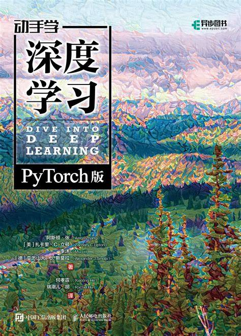

# 深度学习基础（专业核心）

<figure><figcaption></figcaption></figure>

这门课不需要教材。深度学习的相关教材很多，如有需要可以自行选择。

## 课程简介

深度学习基础在AI和DS专业的培养方案中均为必修。课程深入讨论深度学习的内涵，围绕“深度”和“学习”两条主线，重点介绍网络结构和学习算法，及其在计算机视觉、自然语言处理、图分析挖掘、推荐系统等方向中的应用。具体内容包括：深度前向网络、深度学习中的最优化技术、深度学习中的正则化技术、深度卷积网络、循环神经网络、注意力机制、图神经网络、生成网络、无监督学习等。该课程将理论和实践紧密结合，在夯实学生的理论分析能力同时，锻炼学生的动手实践能力。

课程的主要考核方式为实验，附有论文调研等作业，无考试（2026年春季）

## 前置知识涉及的课程

数分线代概统，人工智能与机器学习基础，以及其他机器学习相关的课程。

本课程的实验全部基于深度学习框架进行，需要比较熟练地使用Python的各种包和torch等深度学习框架。当然，由于深度学习对算力有硬性要求，一台好的设备是必不可少的。如果设备不过关可以上107平台，使用学校提供的算力。使用远程算力需要学习ssh等远程连接技术。

## 课堂概况

2026春季开设两个平行课堂，分别由冯福利、王文杰老师，何向南讲授。冯福利班的PPT继承自计算机学院连德富、王皓老师开设的同内容课程并做了部分调整。然而根据某位同学的描述，这份PPT的内容似乎大量来自一本名叫 [_Probabilistic Machine Learning
： An Introduction_](../../geng-xin-gong-gao.md) 的教材，有条件的同学可以试试用教材自学。

课程从深度学习的定义及其与机器学习之间的区别出发，以神经网络为原点，讲授FNN、CNN、RNN、Resnet、注意力机制、Transformer、图神经网络、自监督学习、知识增强、因果启发等深度学习所用的方法，并介绍了大量大语言模型、生成式模型等相关前沿内容。

冯老师和王老师都比较注重课堂活跃度，但没有组织点名和小测。平时上课可能会挑同学回答问题并记录。

本课程面向的群体比较多样，从AIDS到信院计科，再到一些其他专业选修的同学，背景非常丰富。

## 实验概况

2026春的实验共5次，在总评中的占比分别为10，10，10，15，20，最后一次为组队大作业。实验只有说明没有框架，需要同学们从0开始搭建。

### 实验1

非常简单的FNN实验，用糖尿病疾病进展数据集进行回归、调参并分析结果。

### 实验2

非常简单的CNN实验，用Fashion-MNIST 服装图像分类数据集进行训练、测试、调参和结果分析

### 实验3

开始上强度的RNN/Transformer实验，基于IMDB 电影评论数据集进行情感类型预测（分类），需要准备Tokenizer、参照《Attention Is All You Need》原文手动实现多头注意力、实现位置编码和调参分析。

### 实验4

算力需求巨大的自监督学习实验，使⽤
CIFAKE
数据集进行基于SimCLR的自监督学习，需要进行数据增强、训练和调参分析。CIFAKE是一个载有120000张图片的数据集，分为真实的和AI生成的。本实验算力需求巨大，助教特意强调可以不跑全量数据训练，但最低需要使用10%的数据。

### 大作业

使用本课程学习到的知识，在所给的历年股票数据集上进行模型训练，并使用训练好的模型进行预测和为期10天的模拟盘实操比赛。

按照布置作业时给定的标准，大作业的最终效果占比换算到总评大概有4分。

从最终的结果来看，大家炒股的结果和所选10天的A股大盘基本保持一致。最大收益约4%，最大亏损约20%，平均收益率大约为-4%左右。由于A股的骰子涨跌，本作业最终效果的运气成分较大。

## 书面作业

除了实验，本课程还有几次比较简单的书面作业：

1. 设想一个可以利用深度学习解决问题校园实际场景，并说明深度学习相较于传统机器学习的优势。
2. 根据上课讲述的生成式模型相关内容完成部分题目，重点为数学推导和原理解释
3. 调研一篇大模型相关的论文并写调研报告，要有自己的感受和想法。

折算为总评后，两次小作业共计10分，论文调研报告15分。

## 关于Vibe Coding

本课程第一节课就说明了不反对Vibe Coding，但要求同学们完全理解生成的代码。助教在实验验收和报告批改中也会着重关注有无自己的理解。

课程实验的所有框架都需要从0搭建，这也意味着手写所有代码几乎是不可能的，我们需要AI来帮我们完成大量代码。相应地，同学们不需要过于纠结代码的细枝末节，而应当把注意力放在小部分的核心代码上，从而以最快的速度搞清楚AI写出来的代码究竟在做什么，又有什么可能的问题。

不建议使用AI完成实验报告。你可以让AI帮你生成模板和分析数据，但核心的结论需要你自己的思考。

如果对着大量的脚本文件无从下手，可以直接询问你的Coding Agent，让ta帮你解释所写的代码。

## 其他

细心的同学会发现上面所有的分数加起来只有90分。这是因为有10分是考勤分，但是冯福利王文杰老师的课堂没点过名。

