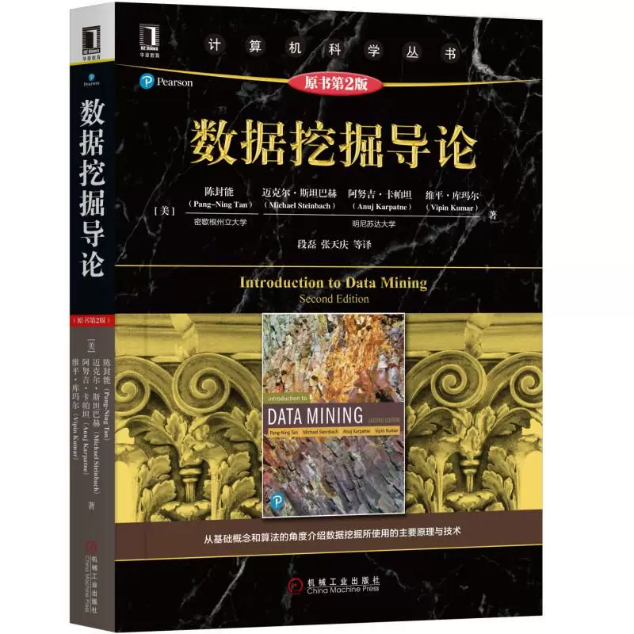

# 数据分析与实践（专业核心）

Represent by Wanglulu：wanglulu114514@mail.ustc.edu.cn

<figure><figcaption>
课程教材
</figcaption></figure>

## 课程简介

数据分析及实践是数据科学专业的专业核心课程，主要内容为数据从生成到处理，再到利用的各个环节以及所涉及到的算法等，内容主要包括数据采集、数据预处理、特征工程、数据统计、数据挖掘。其中数据统计包含各种统计量、参数估计方法、假设检验方法、抽样方法等；数据挖掘包含分类与预测、聚类、关联分析和异常检测等。课程知识量较大，并伴有多次实验。

## 前置知识涉及的课程

概率论与数理统计、机器学习

这门课的四个章节分别叫数据科学基础、数据入门、数据统计和数据挖掘，但是等上完这门课以后会发现这四个章节都有更好的名字：

1. 数据科学科普
2. 数据处理
3. 概统
4. 机器学习

如果你在上这门课前已经上了**人工智能与机器学习基础**，你会在这门课里见到很多熟悉的面孔，尤其是第二章和第四章。

## 课堂概况

刘淇老师执教这门课多年，已经形成了自己独特的上课风格，而2026年春季程明月老师的加入无疑为课堂注入了新鲜血液，真是蒸蒸日上啊。

本课程的排课一般为下午的8、9、10节，但是基本不会提前下课。

课堂讲解完全基于PPT，附带少量板书。这门课的内容100%包含在PPT内，备考完全可以仅依赖PPT。但是本课程的PPT直至2026年春似乎都没有更新过，其中存在的情况包括但不限于：

* 字被图片挡住
* 中英混杂
* 部分内容过时
* 重点不突出

课程讲授的的大多数知识点都是非常有用的，属于数据科学的学科常识和基础算法。

## 与后续课程的联系

数据分析的技术是极其重要的能力，其内涵在于使用数据驱动的思想，数据分析的手段解决实际应用问题，在机器学习的领域之中也占据极其重要的位置。

## 课程资源


