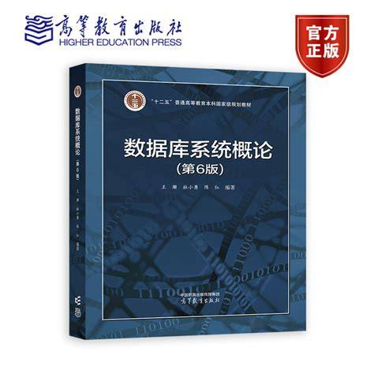

# 数据库系统概论（专业核心）

Represent by Wanglulu：wanglulu114514@mail.ustc.edu.cn

<figure><figcaption>
课程教材
</figcaption></figure>

## 课程简介

本课程是DS专业的专业核心课程，也是AI专业的专业选修课程。课程主要内容为基于关系型数据库SQL的数据库理论和实践。所教授的内容包括但不限于：数据库的各种基本概念、数据库系统、数据模型、关系模型、SQL语句语法、数据库安全性、数据库完整性、关系数据理论与范式、数据库设计、关系型数据库的存储管理、查询优化、数据库恢复、并发控制等。整体上这些内容对应了课本的1-12章（第8章除外），内容较多。

## 前置知识涉及的课程

数据库课程本身涉及的前置课程并不多，只需要知道一些基本的代码知识。在数据库存储管理相关的内容中可能涉及数据结构的内容（尤其是B+树，数据结构课程中这个东西是不做考核要求的，但是数据库存储管理中有很多索引都是建立在B+树上的）；在关系代数理论中可能设计离散数学的内容（主要是函数依赖，不是很恶心，也不是很不恶心）

## 课程概况

本课程由教学经验非常丰富的黄振亚老师教授，黄振亚老师是一位年轻中透漏着老辣的老师，会通过多种途径检测同学们的学习成果。请同学们上课务必认真听讲，并认真对待可能的小测。

课堂内容基本就是老师按照PPT把该讲的知识点都讲完。需要注意的是，这门课的PPT有1000多页，但是对应的课本内容只有300多页。由于PPT和课本的重合度较高，同学们在复习时可以比较多地参考课本。

本课程有两个实验，均为祖传实验。实验1：给定一组数据，导入MYSQL后按照顺序完成对应题目。实验2：按照数据库设计规范的要求，设计一个自己的数据库系统。实验看似不多，实际体量很大。两次实验都需要提交代码和实验报告。

本课程15周结课，期末考试一般直接安排在春季学期的期末周。本课程一般没有期中考试。

## 考试情况

本门课程的考试比较难，题型为选择、计算、综合。根据2026春的实际情况，具体分布为选择题10道，计算题4道，综合题6道。其中综合题的第一大题为SQL语句编写，最后一道为开放题（数据库设计），几乎能够覆盖所有考点。

本门课程的考试比较难的一个原因是**完全没有往年题**。考试题和平时作业关联较大，建议可以多做书上例题。如有需要可以参考计科数据库课程的题目。

与前几年的所谓“文科考试”不同，2026年的数据库考试需要计算和证明的题目明显增多，但是还是有背概念的题目。备考时需要兼顾。

和课本章节对应的考点重要程度如下：

* 绪论：东西多且杂，选择和概念背诵题易考。需要记住数据库四个基本概念、数据模型、三级模式结构。
* 关系模型，必考关系语句操作（写表达式），完整性容易考概念，而且喜欢和第五章的东西连着考。
* SQL：**必考手写代码**。注意不要漏掉视图的部分。
* 数据库安全性：自主存取控制方法里面有**手写代码**的内容，强制存取控制方法大概率会考个选择。
* 数据库完整性：跟第二章对应，同时有完整性定义和触发器的**手写代码。**
* 关系数据理论：范式的定义和不同范式之间互相包含关系的证明必考，公理系统和模式分解会考计算。
* 数据库设计：必考一道大题，对，就是最后那个开放题。把这个章节的目录记住，目录就是数据库设计的环节。还有ER图要会画。
* 关系数据库存储管理和查询优化：各种索引结构需要记住，会考选择和计算。计算大概率考连接操作的I/O消耗计算和各种索引需要的查找次数等。
* 数据库恢复技术：容易考选择和简答，事务的ACID需要记住，日志和检查点机制需要弄懂（会考选择和简答）。
* 并发控制：容易考计算题。记好各种错误类型和隔离级别的对应关系，记好五种锁的功能，还有一个比较简单的冲突可串行化容易考计算。

## 实验技巧

### 实验1

有大量的题目，大概有50多道题。在AI的帮助下大多数题目都能被秒，但是不建议同学们完全使用AI做题，理由如下：

1. 期末是要考手写代码的，与其期末苦哈哈，不如提前实操。
2. 数据的格式可能和你想的不一样，只有亲手做完实验才能发现问题。
3. AI写出来的MYSQL代码和书上教的可能不一样。

由于SQL语句直接对数据库进行操作且不可逆，在实验1过程中很容易碰到某一步骤做错导致需要重来的情况。可以在方便的位置写一句DROP DATABASE，方便直接重来。

### 实验2

设计基于SQL的数据库系统。本实验可以说是整门课的精髓，没做过这个实验可以说等于没上过这门课。

实验的选题比较自由，可以从预设的题目中直接选，也可以在和助教商讨后自己定题目（但我还是要说一句，同学们没活千万不要硬整，容易暴毙）大概在期中之后定下选题，然后按照课堂教授的数据库设计方法进行实操，重要时间节点包括：选题、E-R图验收、代码验收、实验报告提交。实验报告一般在期末考试后提交（也就是说出分会比较晚）

在没有AI的时代，这个实验是组队的，如今我们有了AI，实验也相应地变为了一人一份。这会带来两个重要变化：

1. 展示时间缩减。由于所有人都需要验收展示，每个人的验收时间相对较短，需要在有限的时间内向助教展示出系统的亮眼之处。请务必提前设计展示流程并注意时间。
2. Vibe Coding可能会导致你对自己系统的底层逻辑不熟悉。助教在验收时会提问有关你的底层代码逻辑的问题，请至少要搞懂每个文件里的东西在干什么。

当然，这么大的工作量没有AI大概率是无法准时搞定的，所以该出手时就得出手。Vibe工具选择自己趁手的即可。

黄振亚老师特别强调：本课程不报销Vibe Coding所用的Token

## 给分

本课程的分数分布如下：

* 平时分30，包含作业、点名和小测。特别强调点名和小测三次没来不让考试。
* 实验分20，出乎意料的没那么多。
* 期末考试50，很多很多。

## 其他

老师是资深二次元。

小测有时候会拖堂而且拖的非常长。

## 老学长留下的链接


