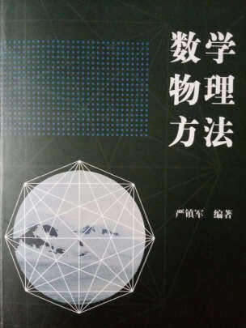

# 数理方程B（专业选修）

<figure><figcaption>
课程教材
</figcaption></figure>

## 课程简介

本课程主要内容包括偏微分方程的基本概念、三类典型方程的导出与定解问题、特征线积分法、分离变量法、贝塞尔函数和勒让德函数及应用、格林函数法、积分变换法等。简而言之，就是学习不同微分方程的解法。

## 前置知识涉及的课程

数学分析、复变函数

## 往年经验

与复变函数的学习方法基本一致，作业及考试的题型比较固定且直接（解各种偏微分方程），拿到每道题后基本上就能想到解答思路，但前提是需要准确记忆各种算法和熟练掌握各定理的直接运用。特别难的公式不需要记忆，考卷上会给提示。该课程学习的主要困难在于：计算难度非常大和计算过程繁琐，特别是在后期涉及特殊函数、傅立叶变换和拉普拉斯变换等，计算时一定要细心。考前可以每个知识点拿几道方程练练手，训练时细致一点，不要投机取巧，讲究计算准确度。该课程对本专业同学无较大裨益，而且学习过程较为吃力，并不推荐大家尝试，把精力留在更感兴趣的课上。

## 与后续课程的联系

与本专业课程无较大联系，学习本课程之后可以更好理解量子物理。

## 课程资源



## 目录

数理方程教学大纲

数学物理方程

分离变量法

贝塞尔函数

积分变换法

狄拉克函数

