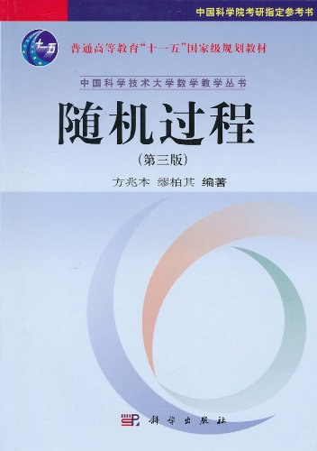

# 随机过程B（专业基础）

<figure><figcaption>
课程教材
</figcaption></figure>

## 课程简介

本课程主要介绍随机过程的基本概念、方法和理论。其中随机过程就是一族随机变量。内容重点为Poisson过程、Markov链和平稳过程。Brown运动只作为大致了解的内容即可。要求掌握这几种最基本的随机过程的有关知识（以样本路径的观点为主）。

## 前置知识涉及的课程

概率论与数理统计、复变函数

## 往年经验

配套教材的书上习题是很好的，有些题目相对较难，平常学习要好好把握体会。考试内容相对固定，题目难度适中，半开卷。要提前做好A4小抄，可以从评课社区中参考，保证不要因为不记得公式而丢分。这门课删减了很多内容，所以这本教材是足以涵盖教学大纲了，但在有些知识上讲解并不是很全面，推荐学有余力的同学看郑坚坚老师编著的《随机过程》，其中的内容要更加丰富全面一些。

## 与后续课程的联系

在机器学习中，随机过程也有广泛的应用，例如“马尔科夫链蒙特卡罗法（Markov Chain Monte Carlo，MCMC）”就需要用到在随机过程中的Markov链的相关知识，该方法是十分重要的统计学习计算方法。

## 课程资源



## 目录

随机过程教学大纲

引论

泊松过程

马尔科夫链

平稳过程

