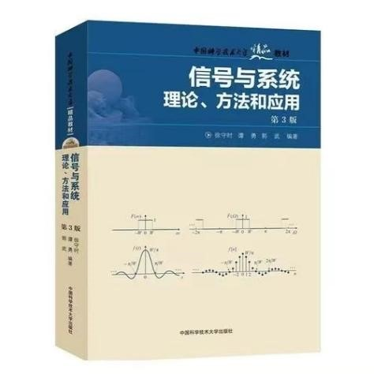

# 信号与系统（专业选修）

<figure><figcaption>
课程教材
</figcaption></figure>

## 课程简介

课程的主要内容包括连续时间和离散时间信号与系统的基本概念；信号与系统的时域和频域分析方法；线性时不变系统的基本特性；连续时间信号的频谱分析及连续时间系统的频域分析方法；连续系统的S域分析方法；离散连续系统的Z域分析方法；系统函数、系统稳定以及信号流程图、系统模拟；系统的状态分析方法等。本课程的目的在于为学生打下信号与系统分析的理论基础，使其能够进一步学习信息传输与处理、通信、控制和网络等的理论。

## 前置知识涉及的课程

电子线路/电路基本理论（电路相关知识）

## 往年经验

课程重点主要在时域部分的卷积计算和频域部分各种傅里叶、拉普拉斯、Z变换及相关应用。学习中注意关注各种变换之间的区别和联系，并且提升数学计算能力。考试分为期中和期末两次闭卷考试，期中考核时域分析，期末主要考核频域分析及其他课程内容。历年期中试题有一定重复，考前可以多练练手提升熟练度；期末试题量稍大，但核心考点一般比较集中，注意解题速度和计算准确率。此外，这门课的知识也是我院学硕（数据科学）信息方向的考研专业课。

## 与后续课程的联系

本课程作为本专业信号与信息处理分析方向的专业选修课，可谓该方向的基石，其课程内容的数学思想也被广泛应用于深度学习、计算机视觉等领域。

## 目录

信号与系统教学大纲

卷积

傅里叶变换

拉普拉斯变换

Z变换

