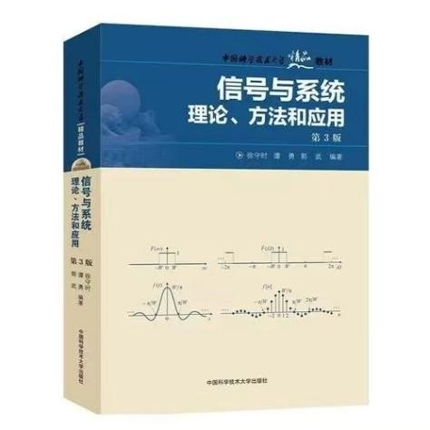

# 信号与系统

## 课程简介

本门课程是6系（电子信息工程）最重要的一门专业基础课程，也是电子信息工程考研必考科目，后续很多课程的前置课程都包含该课程，但对于AIDS的学生来说并不是很重要。本课程主要学习一些关于信号的基本知识。课程总评包括平时成绩+期中成绩+期末成绩。

## 前置课程

数学分析；复变函数

## 课程内容
课程的主要内容包括连续时间和离散时间信号与系统的基本概念；信号与系统的时域和频域分析方法；线性时不变系统的基本特性；连续时间信号的频谱分析及连续时间系统的频域分析方法；连续系统的S域分析方法；离散连续系统的Z域分析方法；系统函数、系统稳定以及信号流程图、系统模拟；系统的状态分析方法等。

期中考试前的内容相对基础，主要涵盖信号的数学描述及其基本性质，包括信号的分类、基本运算与自变量变换，以及典型基本信号的定义与特性。同时，还会介绍系统的基本数学模型，并讨论系统的各类性质，如记忆性、因果性、稳定性、可逆性、时不变性和线性等。

随后进入时域分析部分，重点介绍线性时不变系统的时域分析框架，讲解卷积积分与卷积和的计算方法及其物理意义，并学习如何通过常系数微分方程或差分方程来描述和求解系统。

期中考试之后的内容则是课程的核心——频域分析。首先讲解傅里叶级数与傅里叶变换，包括DFT、DTFT、DFS、CFS、CFT等不同形式，同时介绍典型信号的傅里叶变换对、频谱的物理含义及其性质，并重点讨论信号的抽样及Nyquist抽样定理。接下来的章节主要围绕拉普拉斯变换和z变换及其性质展开，也会介绍这三类变换之间的内在联系。之后，课程将介绍前述理论在实际中的应用，如滤波和调制等。最后，会讲解一些系统相关的知识，如系统函数、系统稳定以及信号流程图等。

## 考试相关

期中考试一般较为简单，主要考察一些性质和计算的内容。期末考试通常来说较难，计算量可能也比较大。期中和期末都是大题。

## 参考资料

[USTC_learning_materials](https://github.com/ly382965/USTC_learning_materials)(https://github.com/ly382965/USTC_learning_materials) 仓库中2SP Signals and Systems A有一些相关资料。此外，也可以到评课社区、我的科大上寻找相关考试资料和课程笔记。
