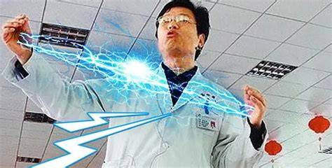

# 电磁学C（物理通修）

<figure><figcaption></figcaption></figure>

永远相信美好的事情即将发生

## 课程概况

电磁学是中国科学技术大学物理通修的第三门理论课，AIDS的同学们需要修读电磁学C。课程的前半部分为电学，后半部分为磁学和电磁波，以及部分电路相关知识。

在引入微积分这一强大的工具后，电磁学在高中很多只能定性分析的问题可以通过计算的方式得出结果，这也意味着电磁学的难度相比高中将会有一个质的飞跃。与此同时，由于物理课程在信智学部的特殊地位，电磁学C也经常受到同学们的**喜爱**，甚至是大家**第二最喜爱**的物理理论课程。

部分少院同学可能已经在大一春季修读了电磁学A，这部分同学可以不用往下看了。

## 前置知识涉及的课程

数学分析、力学

电磁学含有大量的微积分题目，请同学们多多练习各种积分题目。部分题目可能涉及简单的力学分析，最后的电磁波部分可能涉及到波函数。

## 课堂概况

不同老师的授课风格、讲授内容和作业量均不尽相同，大家可以通过评课社区进行了解。

整体的教学内容分为上下两部分。上半学期主要学习电学内容，包括电荷、电场、电势、电介质、电流等；下半学期主要学习磁学、电路和电磁波，包括磁感应强度、磁介质、磁感应强度、基尔霍夫定律、麦克斯韦方程等。

课程设有期中期末考试，一般来说考点不重合（期中考过的东西期末不会再专门出题考察）

此外，电磁学C还会布置可选的小论文，没有答辩环节，直接提交即可。

## 考试技巧

电磁学里面可供使用的定律和结论很多，比如库仑定律、高斯定理、电场环路定理、毕奥-萨法尔定律、安培环路定理、法拉第电磁感应定理、基尔霍夫定律、麦克斯韦方程等，还有很多电荷/电流分布对应的电场/磁场分布可以直接当作已知的来使用。

与此同时，电磁学考试很容易因为出题人品味的影响变成计算大赛，请同学们不要忘记数学分析B2的相关知识，否则会在考场上变成2B。

## 小论文

小论文是各等级电磁学的特色项目，某些班级会举行小论文比赛。小论文在电磁学C中一般没有强制要求，写得好的小论文能够提供1-5分不等的总评加成，因班级而异。

小论文的选题比较重要。课程要求的选题只要与电磁学相关即可，自由度很高，如果选题选得好可以事半功倍。一方面，可以从课堂中老师提出的开放性问题中寻找选题；另一方面，可以从课本带星号的题目中选择感兴趣的题目。

在撰写小论文时可以发挥麦克斯韦精神——纸面物理。AIDS大二上学期的课业压力较大，一般是没有空去做需要实验的电磁学论文的。论文中可以利用电动力学等进阶知识来对某些问题做出更加详细的推导。

小论文建议使用AI辅助编写，但不建议直接全篇生成。

## 其他

期末考试一定要背麦克斯韦方程，可能直接考默写。如果有的题完全不会写就写点麦克斯韦方程，可能混到一两分

波函数将会是量子物理中不得不品的一环，如果在电磁学学了先别急着忘。
