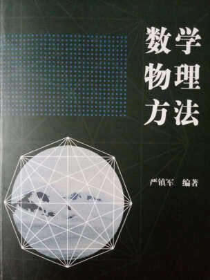

# 复变函数B （专业基础）

<figure><figcaption>
课程教材
</figcaption></figure>

## 课程简介

本课程主要内容是在数学分析所研究上实数域的函数的各种性质的基础之上来进一步的研究复数域上的函数的性质，我们将进一步的探究初等函数的良好性质，还将在数学分析中学习的green公式和taylor展开的基础之上学习cauchy积分定理和laurent展开，最后我们将引入复变函数没有之一的最核心的定理——留数定理，学会使用更好的方法来计算数学分析中无法计算或难以计算的无穷积分。

## 前置知识涉及的课程

大一所学数学分析

## 往年经验

注意准确记忆各种算法和熟练掌握各定理的直接运用，在此基础之上注意对复变函数各定理的理解即可。考试的题型分布也相对固定，考前可以多做几套卷子熟悉熟悉，由于有较多的计算题，考试时应细心一点防止计算失误。

## 与后续课程的关系

计算无穷积分的留数定理方法可以应用于随机过程平稳分布的相关计算当中

## 课程资源



## 目录

复变函数教学提纲

复数和平面点集

复变数函数

解析函数的积分表示

解析函数的级数表示

留数定理及其应用

拉普拉斯变换

