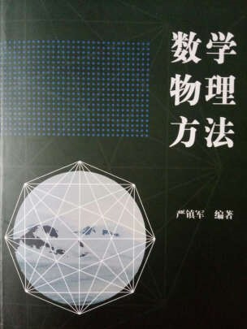

# 复变函数B （专业基础）

<figure><figcaption>
课程教材
</figcaption></figure>

#### 课程简介

大二秋专业基础课程，2.0学分，教材为严镇军的《数学物理方法》，需要有数学分析B1、B2的前置知识。

主要的教学内容为：

* 复数、复数运算与几何含义
* 解析函数、Cauchy-Riemann 方程、初等函数
* 解析函数的积分、Cauchy 积分定理、Cauchy 积分公式
* Taylor 展开、Laurent 展开、关于孤立奇点的级数展开
* 留数定理、Roche 定理
* Laplace 变换、Laplace 变换求解微分方程

第6章保形变换一般不教授也不作考察，需要注意的是，上课老师可能会补充：

* 平均值公式
* 最大模原理
* Cauchy 不等式
* Liouville 定理
* 代数学基本定理
* Morera 定理

这些可能会以背景、考点等出现于试卷的最后一题，可以稍作了解。

#### 往年经验

只需要掌握计算方法与各个定理的运用，无需掌握定理证明，考察形式较为固定，主要考察重点为复数运算、Laurent 展开、C-R 方程、Rouche 定理、积分计算、留数定理的运用、与Laplace 变换求解微分方程，计算量较大，需要在考前练习往年卷。

#### 与后续课程的关系

1. 留数定理会用于随机过程B中协方差函数与功率谱密度函数的变换计算；
2. 数理方程B中，Laplace 积分变换求解法与基本解方法均会涉及；
3. 信号与系统中会涉及傅里叶变换、拉普拉斯变换、Z变换等，需要一定的复变函数知识；

### 课程资源

教材链接：[https://pan.ustc.edu.cn/share/index/62b13f8aa6b14a43ba31](https://pan.ustc.edu.cn/share/index/62b13f8aa6b14a43ba31)

资料链接：[https://pan.ustc.edu.cn/share/index/1cb12a741c39420d9a82](https://pan.ustc.edu.cn/share/index/1cb12a741c39420d9a82)

## 目录

复变函数教学提纲

复数和平面点集

复变数函数

解析函数的积分表示

解析函数的级数表示

留数定理及其应用

拉普拉斯变换

