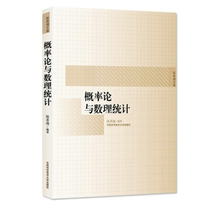

# 概率论与数理统计（专业基础）

<figure><figcaption>
课程教材
</figcaption></figure>

## 课程简介

在高中学过的简单的概率论知识之上，本课程从初等概率的基本理论出发，借助大学所学的微积分方法，研究诸如正态分布的不同分布函数，更进一步，研究更深层次的数理统计的基本概念和方法，**此课程与大数据学院后续的课程联系紧密，其重要性比肩数学分析与线性代数。**

## 前置知识涉及的课程

数学分析

## 往年经验

作为一门数学课，大家在学习的过程中一定要注重于其基本概念的理解与运用，可以通过多做题的方式去理解其中的一些抽象的概念。考试的题型相对固定，考前可以多做几套卷子练练手感。考试数理统计大题需要用到计算器的一些统计功能，考前可以提前熟悉一下，以免考试的时候手忙脚乱出错。另外，因为概统是考研数学的重点，市面上有许多考研资料上有详尽的知识整理、讲解与练习题，可以用来辅助平时的学习与考前复习。

## 与后续课程的关系

概率论与数理统计的基本知识，在大数据学院的后续课程中有广泛应用。诸如大二下半学期的随机过程，便是基于概率论的基础之上展开的。**在人工智能和数据科学领域，诸多模型的数学内核都会涉及到概率论与数理统计的相关知识，其重要性不言而喻。**

## 课程资源



## 目录

概率论与数理统计教学提纲

事件与概率

随机变量及概率分布

随机变量的数字特征

大数定律和中心极限定理

参数估计

注：熵、P值等内容老师课上可能不会讲，但考试可能会考一些简单定义。具体的考试内容以老师考前通知为准

