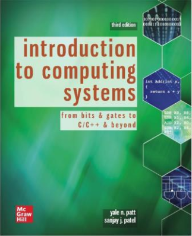

# 计算系统概论（专业基础）

<figure><figcaption>
课程教材
</figcaption></figure>

## 课程简介

作为计算机方向的学生，怎么能不了解计算机的基本组成和运行原理？这是一门深入浅出的课程，课程开始会从介绍数据在计算机中的表现形式出发，到组成计算机的最基本的电路元件，再到如何使用最基本的电路元件组成一个微型的计算机。一步一步从底层上升，围绕一个简单的计算机设计实例（LC-3），依次介绍冯·诺伊曼计算机系统结构模型。在这门课程中，你能了解到计算机是如何利用各种电路元件完成各种高难度运算的，也能了解到计算机是如何在内部的不同部件中传递与储存数据的，也能了解到在运行一个程序时，计算机是如何理解不同的指令进而进行不同的工作，还能了解到计算机的硬件与软件之间是如何进行联系与交互的。总而言之，这是一门内容比较有趣的课程。

## 前置知识涉及的课程

授课课件、作业、教材均为英文，可能需要一些英文基础。本课程大作业可能会涉及C/C++语言的应用（如LC-3汇编器代码补全），可以提前学习一些C++语言的基础知识。

## 往年经验

学好这门课的重点主要在于理解与积累，这门课会有很多较为零碎的知识点，考试题就会有很多意想不到的坑。在学习的时候要注意归纳和总结，这个课程的教材，课件，考试试卷，作业都是全英文形式，所以会比较考验大家的英文水平。这门课的考试方式是开卷，这就需要熟悉本课程教材上的知识点分布，防止考试时翻不到需要参考的页面。

## 与后续课程的关系

本课程属于机组、体系结构、汇编几个课程的融合体，其知识面广度很大，而且对于计算机方向后续的研究具有很大的用处，因为这些知识都是每个cs从业者基本都要了解的。尤其对于计算机组成原理这门考研课。

## 课程资源



## 目录

计算系统概论教学提纲

计算机系统概述

bit、数据类型及运算

数字逻辑

冯诺依曼模型

LC-3结构

编程

汇编语言

输入/输出

栈

