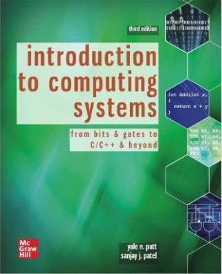

# 计算机系统概论A（专业基础）

<figure><figcaption>
课程教材
</figcaption></figure>

## 引言: 计算机系统概论A与秦始皇

其实上这门课的每一个同学都会注意到, 课程名是 `计算系统概论A` , 而上教务系统查询, 并不存在另一门叫做`计算系统概论B`的课程, 只有另一门名字类似的 `计算机系统概论(H)` 。前者是CS(非英才班), AI, DS三个专业的必修, 后者是CS(英才班)的必修。

按照其他课程的命名规律(例如 `编译原理和技术` 和 `编译原理和技术(H)` ), 特意强调 `计算系统概论A` 是一件很奇怪的事情, 就像哆啦A梦的妹妹叫哆啦美, 野比大雄的两个叔叔叫野比大郎和野比三郎但是他爸叫野比大助一样奇怪。

实际上, 在笔者看来, 这不是一次误用, 而是彰显了课题组的雄心壮志: 誓要把计算机系统概论(下简称为ICS, Introduction to Computer System)的红旗插满全校!

故事的一切要从课程组的安虹老师说起, **2011 年夏季学期**, 安虹老师邀请到了大名鼎鼎的 Yale Patt 教授来给科大的同学们上一门选修课 `计算机系统概论` ,所用的教材就是他的名著 _Introduction to Computing Systems: From Bits and Gates to C and Beyond。_

这期间, 安虹老师和Patt交流了什么, 我们不得而知, 只知道之后不久就迎来了ICS这门课程. 据说她一直努力推动全校通修ICS, 所以在更名时特意改成了 `计算系统概论A` ,这一幕无不像秦始皇当年, 号始皇帝, 想要王朝传千代万代. 可惜随着AI时代的到来, 全校加了一门人工智能的通修课, 恐怕ICS的通修大梦也只能和秦始皇的春秋美梦一样粉碎了.

## ICS学什么: 为什么ICS广受差评

上评课社区上我们不难发现, ICS的分数可谓惨不忍睹, 其中不乏有人用长篇大论说明这门课的缺点. 实际上类似定位的课程在其他兄弟高校也存在, 为什么似乎唯独妮可的ICS这样广受诟病呢?

为了理解这个问题, 我们得先清楚ICS到底学习什么, 不妨就从教材说起。 本课程的官方教材&#x662F;_&#x49;ntroduction to Computing Systems: From Bits and Gates to C and Beyond 3rd edition_, 这是一本**纯英文**的教材(当然有一些翻译的尝试, 本人也参与了其中部分章节和插图的翻译), 而市面上主要能买到的中文版教材是第二版。 部分细节上有所出入, 因此大家不可避免的得拥有一本英文版教材(或者至少是附录C的打印版)。 这也带来了 ICS 第一个广为人诟病的地方: **从教材, PPT到作业, 实验, 考试都是全英文的**!! 当然, 考试的形式是**开卷**, 是允许携带字典, 或者临时问助教某些单词的意思。 笔者考试的时候就见到一位女生抱着一个大大的纸箱, 里面装了801面的英文第三版教材, 薄的多但封面也丑的多的第二版中文教材, 打印的习题课PPT和往年题目, 还有一本厚厚的英文词典。 我相信就算这门课没能做到文明其精神, 也能野蛮其体魄.

本书的教材一共有20章, 当然受到课时限制, 基本上只能讲完前9章, 后面的地方也不做考察。 第一章绪论就无需多言, 第二章是整数/浮点数的bit级别的存储, 3-4章讲晶体管, 各种门, 时序逻辑电路, 组合逻辑电路, 5-6章引入了臭名昭著的LC-3指令集, 7-9章讲汇编语言, 队列和栈, 输入输出。

读者看完这些可能仍然一头雾水, 比如浮点数怎么存储和逻辑门看起来比较不相干, 但是我觉得这个顺序还是比较能体现作者对于"计算"的抽象理解. 首先, 我们得定义一些数字的表达方式, 以及一些可以表达数字和进行操作的硬件. 然后就像搭积木一样, 固定硬件的组合变成了二级积木, 二级积木再组合就变成了三级积木。援引冯文俊学长对这门课的描述： 

作为计算机方向的学生，怎么能不了解计算机的基本组成和运行原理？这是一门深入浅出的课程，课程开始会从介绍数据在计算机中的表现形式出发，到组成计算机的最基本的电路元件，再到如何使用最基本的电路元件组成一个微型的计算机。一步一步从底层上升，围绕一个简单的计算机设计实例（LC-3），依次介绍冯·诺伊曼计算机系统结构模型。在这门课程中，你能了解到计算机是如何利用各种电路元件完成各种高难度运算的，也能了解到计算机是如何在内部的不同部件中传递与储存数据的，也能了解到在运行一个程序时，计算机是如何理解不同的指令进而进行不同的工作，还能了解到计算机的硬件与软件之间是如何进行联系与交互的。总而言之，这是一门内容比较有趣的课程。

当然, 这门课的争议点之一也在于这里, 计算机对于抽象做的是很好的. 一个写c程序的人不需要知道编译器具体怎么做把它变成可执行文件, 编译器也不需要关心CPU内部晶体管出问题了怎么办. 更何况现在很多人都开始prompt甚至loop编程, 笔者自己一天敲键盘写的代码也不会超过百行. 这时候再关注底层的意义就有待商榷.

另一部分同学, 他们很好奇底层到底发生了什么. 对于这部分同学, ics同样难以满足他们的需求: LC-3几乎是一个玩具, 连基础的乘法指令都没有提供; 课程节奏有点拖沓, 甚至出现每周的3\*45min的上课时间拿出一小时让大家做题讲题的情况.

## 课程简介

## 前置知识涉及的课程

授课课件、作业、教材均为英文，可能需要一些英文基础。本课程大作业可能会涉及C/C++语言的应用（如LC-3汇编器代码补全），可以提前学习一些C++语言的基础知识。

## 往年经验

学好这门课的重点主要在于理解与积累，这门课会有很多较为零碎的知识点，考试题就会有很多意想不到的坑。在学习的时候要注意归纳和总结，这个课程的教材，课件，考试试卷，作业都是全英文形式，所以会比较考验大家的英文水平。这门课的考试方式是开卷，这就需要熟悉本课程教材上的知识点分布，防止考试时翻不到需要参考的页面。

## 与后续课程的关系

本课程属于机组、体系结构、汇编几个课程的融合体，其知识面广度很大，而且对于计算机方向后续的研究具有很大的用处，因为这些知识都是每个cs从业者基本都要了解的。尤其对于计算机组成原理这门考研课。

## 课程资源



## 目录

计算系统概论教学提纲

计算机系统概述

bit、数据类型及运算

数字逻辑

冯诺依曼模型

LC-3结构

编程

汇编语言

输入/输出

栈

