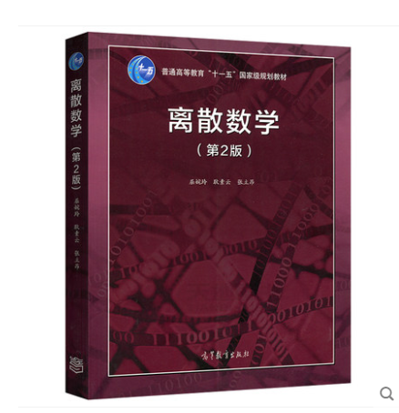

# 离散数学（专业基础）

<figure><figcaption>
课程教材
</figcaption></figure>

## 课程简介

本课程主要介绍数论，群论，图论，数理逻辑的基本概念和一些基础结论，其中群论和图论是重点部分。这门课程需要重点掌握好数论和群论之间的联系，尝试用群论的方法解决数论的问题。同时老师还会专门讲一些经典的图论的算法，对于图论的算法，要能够保证算法的严谨性。而数理逻辑部分只要做到基本了解即可。

## 前置知识涉及的课程

无

## 往年经验

这门课由于时间限制导致各部分内容压缩严重，针对数论和群论部分建议参考《代数学基础》，针对图论部分可以参考徐俊明的《图论及其应用》，数理逻辑老师课堂笔记即可。此课重在知识和概念的理解，刷题并不是很重要，但适当的找一些有趣的题做可以开阔思维，平时作业比较少，建议上课认真听课，跟着老师记笔记。有不会的问题当堂下课找老师及时解决，期中期末要反复复习课堂笔记。

## 与后续课程的关系

与后续课程的联系：代数结构，图论，数理逻辑可以称为计算机数学基础三部曲，本门课简单用一学期时间带大家入门。密码学中涉及了大量的数论内容，群论则能提供大家一次抽象思维的提升，而图论基础和算法是重中之重，对于后续学习算法基础能提供初步的认知，并且当前很多AI的前沿方向都和图结构有关。

## 备注

截止2022年本课程在大数据学院均是丁虎老师授课，授课教材为老师的讲义，没有用过学校所发的图中的教材

## 课程资源



## 目录

离散数学教学提纲

代数结构

群论

图论

数理逻辑

