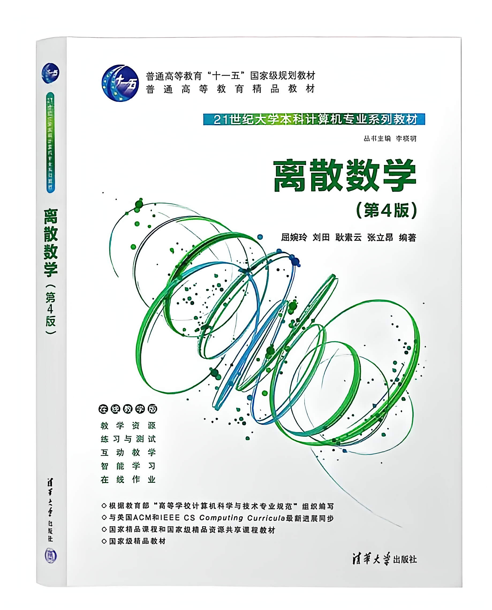

# 离散数学（专业基础）
Written by 沫影.（欢迎vx扩列：D_Chloroplast）

### Part 1 课程简介

离散数学是大二的专业基础课之一，DS专业于秋季学期修读，AI专业于春季学期修读。作为“计科三部曲”的压缩版，离散数学需要在一学期内学完集合论、数理逻辑（命题逻辑&一阶逻辑）、关系、函数、图论、数论与代数结构，上课进度偏快，且课程教学内容具有一定难度，但考试难度相较课程内容而言偏低。26春期中考察图论之前的内容，期末考察图论、数论和代数结构，采用平时:期中:期末=2:3.5:4.5的评分方式，并有一定程度的调分。（p.s.笔者于26年春季学期在<ins>秦晓卫老师班级</ins>修读此课程，以下内容根据笔者自己的课程体验撰写而成，秋季学期邵帅老师班级的教学方式/考核题型可能和下文有较大差异。）

附上教务处写的课程简介（由于课时原因，一般而言这些知识点不会全部上完，具体授课/考核范围取决于老师安排）：本课程讲述离散数学的基本概念和理论，主要内容包括：(1) 集合、关系、函数等基本概念和理论；(2) 图论的基本概念和方法; (3) 代数系统的基本概念、几个重要的代数系统：半群、群、环、域、格与布尔代数；(4) 组合数学，其中包括组合存在性、组合计数、组合设计与编码以及组合最优化。(5) 数理逻辑，其中包括命题逻辑、一阶谓词逻辑、Her-brand定理和直觉逻辑。

课程教材见文末。

### Part 2 教学内容

如前所述，这门课每学期教授的内容因老师/课时安排而异，以下是笔者根据授课PPT、作业题与考试真题自行总结的知识点大纲，供复习参考：
* ⭐️数理逻辑
  
  数理逻辑分为命题逻辑与一阶逻辑两部分，其中命题逻辑是基础，一阶逻辑于此之上进一步引入谓词、量词等概念。此部分是期中考试的重点考察对象，核心知识点包括：命题符号化、等值演算证明命题等价、**语义推理**（自然推理形式系统 $N$ 、自然推理系统 $N_L$ ）、联结词完备集、**主析（合）取范式**、**归结证明**。
* 集合论、关系、函数

  这几个部分的知识点不多，集合论的基本概念与高中数学有所重合，主要考察演算证明。关系考察矩阵表示和图表示、三大性质（自反性、对称性、传递性）和**闭包构造（Warshall算法）**、**等价关系（等价类）** 和**偏序关系（格）**。❗️这一部分是下半学期图论和代数结构的根基，学习的时候注意对概念的理解 ~~（否则下半学期可能跟不上）~~。函数则考察映射、复合、**等势**、**基数（可数集、无穷集等）**。
* ⭐️图论

  图论的概念比较杂，定理和算法也多，是期末考试的重点之一。图论考察的知识点主要包括：基本概念与定义（出入度、连通度、特殊图如 $K_n$、$C_n$等、**图的不同矩阵表示**）、连通性、二部图的判定与算法（匹配相关算法）、**欧拉图与哈密顿图及其判定定理**、**同构**、**平面图的欧拉公式及其判定定理**、**着色问题**。❗️这一部分考的不难，但请在考前保证你记住了基本概念与定义。
* 数论

  数论的知识点比较浅显易懂，内容也不多。这一章主要考察素数（梅森数、欧拉函数）、**同余方程求解**、**密码学（RSA算法）**。
* ⭐️代数结构

  代数系统是研究集合与其上运算结构的部分，主要研究集合上的运算性质以及不同代数结构之间的关系，这一部分通常被认为是整门课程中最抽象难懂的章节，知识点又多又杂并且不是很直观，定理理解和证明要求较高。核心内容包括：各类代数系统的定义及证明（群、环、域、格与布尔代数）、子代数、积代数、**同态与同构**、商代数等。

### Part 3 如果你想拿高分的话…

**1. 关注考前重点梳理**
   
考前老师划重点的课一定要去听❗️❗️❗️老师会在最后一节课明确说明考试题型、分值分布以及重点考察范围，并带领大家梳理PPT，标注考试重点内容。由于课件中的知识点并非全部都会考（比如26春就不考图论中的算法问题），认真听这节课能够帮助大家明确复习重点，提高复习效率。

**2. 关于复习资料**
   
这门课没有往年真题或模拟题，因此大考前主要参考资料包括：
* 课本
* 平时作业
* PPT课件

尤其需要注意的是，老师曾提到考试中会涉及作业题，因此作业中的典型题目需要认真掌握。

**3. 怎么复习？**
   
⚠️不要盲目相信自己能一晚上背完所有知识点！不要盲目相信自己能一晚上背完所有知识点！不要盲目相信自己能一晚上背完所有知识点！！！

离散数学这门课知识点较多，临时突击效果有限，提前梳理会明显降低复习压力。笔者建议期中提前三天、期末至少提前一周左右开始复习。无论是希望系统性复习还是复习时间较紧，你都可以试着按照以下流程复习：

* 根据老师划定的重点梳理 PPT
  
  先快速过一遍重点内容，熟悉考试范围内的概念和定理。不要一开始就从头到尾复习全部PPT，把时间花在老师强调必考的知识点上。
* 刷课本习题，熟悉定理应用
  
  过完第一轮PPT之后，优先完成平时布置的课本习题。遇到不会的题目及时回看PPT，补充遗漏的知识点。课本习题通常更偏基础，不仅可以帮助巩固基础概念，也能够加深对定理应用方式的理解，是复习过程中非常重要的一环。
* 完成作业补充题
  
  在掌握基础知识后，再练习作业中的补充题。补充题同样是复习过程中不可忽视的一部分：一方面，考试中涉及的作业原题通常会从补充题中选取；另一方面，由于教材内容与课程PPT存在一定差异，对于PPT中涉及但教材未覆盖的知识点，老师会通过补充题帮助大家理解和练习。（p.s.补充题难度通常高于考试题，第一次不会做很正常，没有必要过度焦虑。）

* 如果你还有时间，可以复习PPT里的例题。
   
如果时间非常紧张，请优先保证：
* 掌握基本概念和定义；
* 熟悉重要定理及其应用条件；
* 理解作业题的解题思路。

此外，笔者认为对这门课而言，盲目刷大量习题的收益有限，更重要的是理解概念、掌握定理以及学会灵活应用。但如果你实在不放心，可以刷课本后的习题练手。

### Part 4 一些来自笔者的碎碎念
 
离散数学其实是一门比较特别的课程。它的知识点看起来零散，但实际上背后蕴含着许多计算机科学中的基础思想。如果不只是为了考试而学习，会发现这门课中有不少有趣的内容。

如果时间和精力允许，不妨尝试以兴趣而不仅仅是绩点为导向学习这门课。比如，在学习图论中的算法后，可以尝试将其应用到算法竞赛题中；又或者，在掌握一些理论知识后，主动寻找一些证明题进行思考。亲手解决一个看似困难的问题，或者发现一个漂亮的证明过程，往往会带来比考试得分更长久的成就感。这些思考和探索的过程，也是数学学习中非常珍贵的体验。

同时离散数学中的不同章节难度差异也比较明显。比如下半学期的学习中，数论部分相对基础，在下半学期较为紧张的图论与代数结构之间提供了一段难得的缓冲时间。（笔者正是在学习数论的过程中，一度对密码学中的数学问题产生了浓厚兴趣）

此外，对于人工智能专业的同学而言，大一下学期的培养方案相对宽松，如果希望提前修读部分课程，离散数学会是一个不错的选择。这门课虽然具有一定难度，但作为计算机专业基础课程之一，能够帮助大家提前接触许多后续课程中会反复出现的数学思想。

最后，希望每一位看到这里的同学，都能够在学习离散数学的过程中有所收获。无论你的目标是取得理想成绩，还是单纯探索数学与计算机科学之间的联系，都希望这门课能够成为一次有趣且值得回忆的学习经历。
### Part 5 备注

截止2022年本课程在大数据学院均是丁虎老师授课，授课教材为老师的讲义，没有用过学校所发的图中的教材。

2023和2024年离散数学在本学院为邵帅老师授课，没有教材，授课方式为纯板书。

2025和26年春季学期在人工智能专业是秦晓卫老师授课，授课方式以PPT为主，教材使用屈婉玲的《离散数学（第4版）》。

### Part 6 课程教材
<figure><figcaption>

</figcaption></figure>
