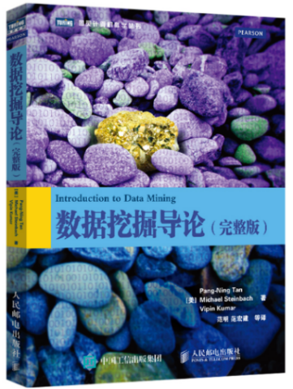

# 数据分析与实践（专业核心）

<figure><figcaption>
课程教材以老师PPT为主
</figcaption></figure>

## 课程简介

本课程主要从数据科学基础，数据统计，数据挖掘，机器学习等方面入手，较全面地描述了数据分析的全过程。这是一门实践导向的课程，它的主要编程工具为Python，内容包括如何获取数据（爬虫），如何在原始数据之上进行特征工程，统计分析，可视化实验，如何使用机器学习基础算法。课程的最后还会给出一项情景任务，之前两年给过的任务是根据某场LOL比赛的场上数据预测比赛胜率和根据某国家学生的各项能力得分预测其数学成绩。本课程没有期末考试，平时的每项实验都很重要，课程中后期还会有一项调研报告任务，其会培养同学们查找资料、阅读论文、书写报告的能力。

## 前置知识涉及的课程

数学分析、线性代数、概率论与数理统计

## 往年经验

作为一项实践性的课程，同学们可以提前熟悉Python的使用，jupyter的使用，调研报告的书写技能（可以使用Typora），课程中会涉及一系列机器学习基础算法，由于课程内容比较多，某些算法可能不会细讲。有兴趣的同学可以去B站看看吴恩达的机器学习/深度学习网课。

## 与后续课程的联系

数据分析的技术是极其重要的能力，其内涵在于使用数据驱动的思想，数据分析的手段解决实际应用问题，在机器学习的领域之中也占据极其重要的位置。

## 课程资源



## 目录

数据分析与实践教学大纲

数据科学基础

数据分析入门

数据统计

数据挖掘基础

