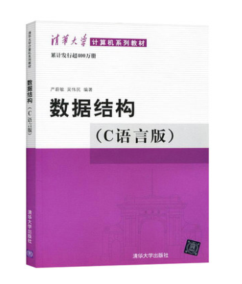

# 数据结构（专业基础）

<figure><figcaption>
课程教材
</figcaption></figure>

## 课程简介

本门课主要是介绍常用的各种数据结构，如线性表，栈和队列，串，数组和广义表，树，图，查找。主要是锻炼数据抽象能力和程序设计能力，并且要求学生能够对算法的时间和空间复杂度有一定的分析能力，**是计算机极其重要的基础课程。**

## 前置知识涉及的课程

C语言

## 往年经验

学有余力的同学可以预先针对当前数据结构了解更多的算法，由于本门课较注重理论与实践的结合，所以可以尝试对很多算法进行复现，深入了解各种数据结构的灵活应用，甚至可以尝试leetcode。期末闭卷考试，如果平时认真写代码，对各种结构的代码有较深刻的印象，可以从容应对期末的算法题，卷子中的选择和填空以基础理解为主，相对而言比较轻松。

## 与后续课程的关系

为《算法基础》这门课打了一定的基础，算法基础中的各种算法就是基于各种基础的数据结构运行的，如果能有一个良好的数据结构功底，那么算法基础中的算法理解和代码实现会更加轻松。

## 目录

数据结构教学提纲

线性表

栈和队列

串

数组和广义表

树

图

查找

排序（部分老师会讲）

