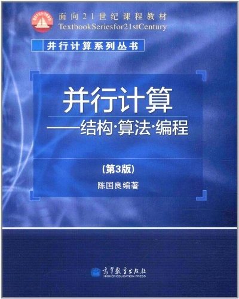

# 并行计算（专业选修）

<figure><figcaption>
课程教材
</figcaption></figure>

## 课程简介

本门课是计科开设的选修课，信院也开了一门并行计算B，目前不清楚信院的课能否计入大数据的选修学分。主要方向是并行计算的硬件基础，即当代并行计算机的体系结构模型，着重讨论并行计算的核心内容，即并行算法的设计和典型常用的并行数值算法，以及并行计算的软件支持，即并行程序设计的原理和主要的编程方法。

## 前置知识涉及的课程

C语言、计算系统概论A

## 往年经验

考试内容方面，计科开课基本上是孙广中老师和徐云老师轮流开课，孙广中老师的课程详见评课社区，徐云老师这边课程内容比较丰富，不过所用ppt和实验设计多为祖传内容，比较无趣。考试内容基本上年年重复度都较高，去评课社区找一份往年的卷子看一遍就够了。

## 与后续课程的联系

与后续课程的联系不大，但是如果研究生期间或者后续对高性能计算方向的研究内容感兴趣的话，可以选课作为入门。

## 目录

并行计算教学大纲

高性能计算

并行体系结构

