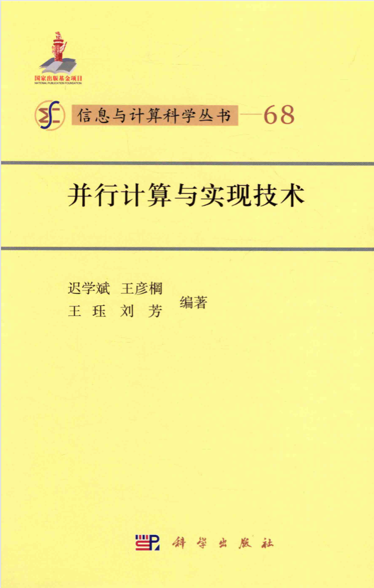

# 并行计算B（专业选修）

课程教材：

### 课程简介

这门课程是人工智能专业同学在3春可以选修的一门专业选修课程，由信院开设，本人修读时由谭立湘老师教学。在当今AI时代，算力需求与日俱增，对硬件和算法的性能与速度都提出了更高的要求，AI Infra、分布式计算、高性能计算等也均需并行计算技术作为基础。在这门课程，你可以学习到CPU的多线程并行技术OpenMP，GPU并行编程技术CUDA，相关的硬件知识如GPU的架构、迭代历史，并行计算原理与设计思想等。学习后，或许可以对我们日夜接触的CPU与GPU有更深刻的理解。

### 前置知识涉及的课程

计算机程序设计

### 往年经验

**课程考核**形式为**大作业**，需要利用所学的OpenMP、CUDA或其他并行编程技术，自行完成一个并行项目，选题与难度不限，可以选择大模型推理加速、图像处理加速、粒子模拟等，编程语言任意，但老师提及需要一定工作量，并完成一份相应论文，字数约2k至3k。源代码需打包上传。

**日常作业**为**五个小实验**，要求使用C/C++完成编程，内容为：实验环境配置、排序算法并行加速、矩阵乘法并行、FFT并行、图像处理并行，具体内容仍然自行拟定，如选择何种排序算法进行并行，采用何种并行方式等。每个实验对应一份200-300字报告，附代码，可附改进等。

(Tip：环境配置上，如果大家使用VS Code进行C/C++编程，需要自行配置一些编译选项，CUDA的安装也涉及环境变量相关操作。大家配置时，最好梳理一下电脑中有哪些编译器：GNU的gcc、MSVC的cl、llvm，以及CUDA专用的nvcc，多多留意路径与环境变量，并适当询问AI，可以事半功倍。)

此外，还有一些**额外加分**。大作业验收后，择日会开**报告会**，如果报名需要做PPT来演讲项目，约7分钟，台下同学如果提问也可加分。另外对于我所上的2026春班级，如果上课积极回答问题，可以得到加分；偶有点名，可能影响平时分。

附助教的信息汇总：【腾讯文档】GPU并行计算2026春季课程信息汇总 [https://docs.qq.com/doc/DRFV4bHFIWEVqUHF3](https://docs.qq.com/doc/DRFV4bHFIWEVqUHF3)

### 与后续课程的联系

这门课程可以作为并行计算的入门，有兴趣的同学可以利用学到的OpenMP或CUDA编程技术，重写或加速自己在其他课程中的实验、脚本，如图像处理等。更大的项目与实践大多会借用一些现成的库，如CUDA版`PyTorch`，或Triton等语言。因此，课程所学主要还是作为**并行计算的启蒙与入门**，而非后续课程的直接前提与必要预修。

### 课程资源

链接：[https://pan.ustc.edu.cn/share/index/d3ca18f63d72477d974f](https://pan.ustc.edu.cn/share/index/d3ca18f63d72477d974f)

### 目录

课件PPT顺序

1. 绪论
2. 并行计算基础
3. OpenMP (CPU并行)
4. GPU硬件架构
5. GPU软件体系
6. CUDA编程实例
