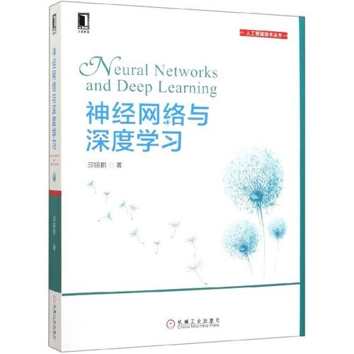

# 深度学习导论（专业核心）

<figure><figcaption>
课程教材
</figcaption></figure>

## 课程简介

本门课自2019级开始改为大数据学院的必修学科群基础课。主要内容包括DNN相关、CNN相关、参数优化（调参技巧）、RNN相关、Attention机制及相关模型（Transformer、BERT）、GCN相关、无监督模型尤其是生成式模型（VAE、GAN）等内容。可以说课程内容涵盖了CV、NLP等各个应用领域，也涵盖了分类、回归、生成等各路任务，讲授的内容也与AI的前沿研究关系紧密（比如xxFormer、xxGAN）。但是由于课程全而较为深入，所以讲授的速度较快，对于没有做过的方向可能上手有一定理解的难度。

## 前置知识涉及的课程

机器学习

## 往年经验

本课程无作业、无考试，成绩由5个小实验（CNN相关、RNN相关、BERT相关、GCN相关和GAN相关）和Kaggle实验组成。其中小实验由于需要一定量的训练需求，有联系华为云提供多次的500元服务器的券（可以多手机多注册）。实验前一部分给出了基本的深度学习框架（Pytorch），后一部分需要自己编写完整的深度学习框架，对于没有深度学习经验的同学可能上手有一点难度，可以[参考](https://www.youtube.com/watch?v=2S1dgHpqCdk\&list=PLhhyoLH6IjfxeoooqP9rhU3HJIAVAJ3Vz)油管上的Pytorch Tutorial，也可以参考《[动手学深度学习](http://zh.d2l.ai/)》。由于深度学习研究的火爆，这门课讲授内容基本上是前沿研究的基础内容，所以网上具有极其丰富的资料，请大家善用Google和Github。Kaggle实验2人组队完成，可选题目很多样，包括推荐、CV、NLP、语音等多种竞赛题目，最后根据竞赛的排名和最终的答辩成绩进行评价。

## 与后续课程的联系

无本科阶段后续课程，为之后AI相关的科研研究打好基础。

## 目录

TODO

