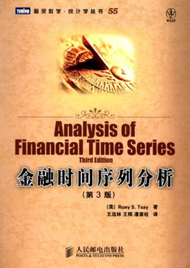

# 时间序列分析B（专业选修）

<figure><figcaption>
课程教材
</figcaption></figure>

## 课程简介

时间序列分析是一门学习如何对经济数据建模，从而预测、分析和假设检验的课程，内容包括差分方程、平稳时间序列建模（ARMA模型），波动性建模（GARCH模型），包含趋势的模型、多方程时间序列模型和协整和误差修正模型。

## 前置知识涉及的课程

R语言，随机过程

## 往年经验

这门课基本不需要运用到非常高深的前置知识，要求较低，但是写实验需要用到R语言，简单自学即可。要注意这门课是闭卷，需要记背一些模型，建议从推导开始记，这样对模型的理解更深。对于考试，大部分都是简单的应用，略有一些证明和性质的推导，大部分题目都改编自教材课后习题、随堂测试题和往年卷，老师给分很好。

## 与后续课程的联系

时间序列分析与信息通信、量化金融、生物信息等方向关系较大

## 目录

时间序列分析B教学大纲

时间序列

差分方程

平稳时间序列建模

