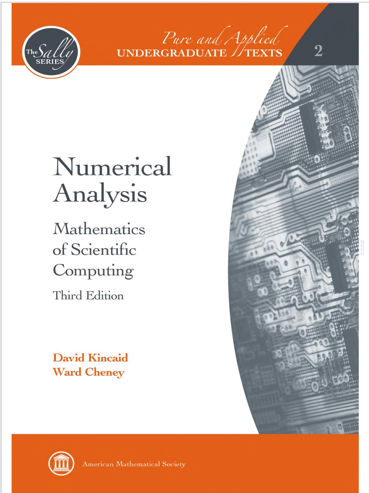

# 数值分析（专业选修）

<figure><figcaption>
课程教材
</figcaption></figure>

## 课程简介

数值分析是数学的一个分支，它提出、发展、分析并应用科学计算中的方法于若干领域，如分析学、线性代数、几何学、逼近论、函数方程、优化问题和微分方程等。可以简单地认为数值分析就是讨论如何求解微积分中的计算问题，主要研究对所设计的数值方法进行算法稳定性、精度和计算复杂性的分析。课程内容包括函数插值与逼近、数值微分与积分、常微分方程数值解。

## 前置知识涉及的课程

数学分析，线性代数。推荐先修数值代数，泛函分析

## 往年经验

这门课由徐老师教授了很长时间，相比于陈先进老师的数值代数更需要一定的数学功底（没有也行），部分知识点理解起来有一定的难度，需要投入一定的时间。作业和实验量也比较大，但是难度不是非常大，考试难度不大，注意计算的准确性即可。

## 与后续课程的联系

> 林伟教授：我常常被问到，人工智能到底能不能够激发新数学的发展，这种新数学在做基础数学的人看来不一定是新的，但可能跟一些我们意想不到、不那么常用在智能领域的数学分支发生联系？
>
> 我对这个问题做了些思考，大概收集十个方向。首先，有四个部分知识大概是我们在人工智能领域里用得比较多的：
>
> * 一个是概率论、数理统计；
> * 一个是数值代数、数值分析、最优化；
> * 一个是经典分析、函数论，比如深度学习里很重要的一块是知道逼近论的知识；
> * 计算机科学基础，包括离散数学、理论计算机科学。

## 目录

数值分析教学大纲

函数逼近

数值方法

数值微积分

数值微分方程

