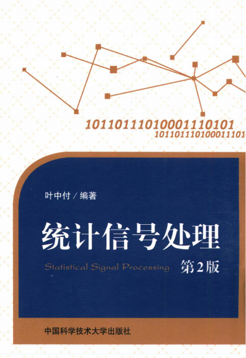

# 统计信号分析与处理

## 课程简介

本门课程同数字信号处理A，信号与系统A，现代通信原理，信息论A一样，同为6系（电子信息工程）的专业必修课，以及AIDS专业的选修课程，因此如果不是必修的话不建议修读，不过作为大三下的课程，本门课只要正常复习一般来说及格比较容易。教材目前已更新为学校出版社出版的教材，课程总评包含平时成绩+期末成绩。

## 前置课程

概率论与数理统计；信号与系统；随机过程

## 课程内容

教材主要章节为第三章、第五章、第六章，其中第三章占比较大。第一章和第二章很大一部分是6系之前就学过的内容，在此基础上拓展了一些公式，然后讲解了AR、MA、ARMA三类模型。

第三章部分为信号检测（检验），主要是用于判断信号是否存在或属于哪一类，在几个可能的假设（如`H0`: 无信号，`H1`: 有信号）中做出判决。这里会讲到多个准则，包括贝叶斯准则，最大后验概率准则，最小错误概率准则，NP准则等等准则，此外还有一些较为复杂的内容，如高斯白/色噪声中信号的检测，随机参量信号的检测，这些内容内容较多，难度较大。

第五章是信号估计，即估计出信号中未知的确定参数，这里主要考虑估计量、无偏性、有效性、一致性。会学习一些估计方法，如最大似然估计、最小均方误差估计、最小二乘估计等等，这些内容和机器学习的一些理论也颇为相似。

第六章主要讲解线性滤波，本课程中主要涉及维纳滤波，分别要考虑物理可实现和物理不可实现的滤波器的设计。

## 考试情况

考试分为小题和大题两部分。小题主要考查概念性内容，只要把教材中的基本概念理解清楚，一般问题不大。大题方面，第二章可能会出题，但难度不大；第三章内容较多，因此在考试中占比较高；第五章和第六章通常各出一道大题。由于可用的复习资料有限，本课程的复习重点应放在作业题的掌握上，考试中不少题目的思路与作业题较为接近。另外，由于考试整体难度较高，因此2026年春季学期的调分幅度较大（不过在此之前，貌似调分不是很多）。

## 参考资料

见评课社区上相关回忆版试卷，以及[USTC_learning_materials](https://github.com/ly382965/USTC_learning_materials)(https://github.com/ly382965/USTC_learning_materials) 仓库中3SP Statistical Signal Analysis and Processing的相关资料。
