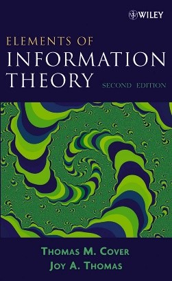

# 信息论A（专业选修）

<figure><figcaption>
课程教材
</figcaption></figure>

## 课程简介

本课程从香农信息论的基本观点出发，以概率论和随机过程为数学工具，建立信息及其度量的基本概念；以信息推断、信息传输和信息表征等作为应用背景，建立决策、编码、压缩等问题的数学模型；在此基础上，逐步构建信息推断、信息传输和信息表征等问题的基本框架，介绍其相应的基本性能极限，并给出基本的分析思路和方法。进一步地，通过若干应用实例的介绍，展示信息论在通信与信息处理等工程系统中的应用范例。

## 前置知识涉及的课程

概率论与数理统计

## 往年经验

这门课程重在概念和公式的理解。课程前中期会介绍大量的概念和定理，逐步引出该课程（甚至可以说是信息论这个学科）最核心的定理——信道编码定理，让我们得以窥探现代通信技术建立的理论基石，非常推荐感兴趣的同学选修。另外教材写的深入浅出，每个定理的证明都非常严谨详细，建议同学们跟着老师上课的节奏（或者提前一些）通读教材的相关章节, 以对概念和定理有更深刻的理解。（龚晨班）除了几乎每节课都有的习题外，还有一个课程project 和期末考试（闭卷,可以带一张A4小抄），但没有期中考试。课后习题均来自于课本，最好自己参考书中相关证明独立完成，不会做可以参考[课后习题答案](https://cpb-us-w2.wpmucdn.com/sites.gatech.edu/dist/c/565/files/2017/01/solutions2.pdf)。

## 与后续课程的联系

该课程能够提供对数据在信息层面的认知，有益于今后的数据科学研究。数据科学研究的内容一般是数据之间的关联性，这个关联可以从信息论的角度给出一个上界，也就是互信息。信息论里的熵、KL散度、互信息等概念都是建立学习目标（learning objective）的常用工具。

## 目录

信息论教学大纲

信源编码定理（香农第一定理）

信道编码定理（香农第二定理）

率失真定理（香农第三定理）

