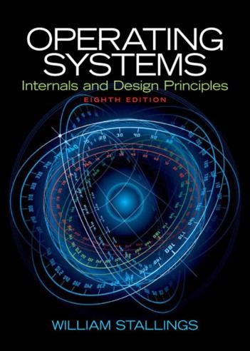

# 操作系统（专业选修）

<figure><figcaption>
课程教材
</figcaption></figure>

## 课程简介

操作系统是计算机系统的不可或缺的组成部分，是软件技术的核心和基础运行平台。这门课程重点讲述计算机操作系统的基本概念，工作原理以及典型技术的实现。其中包括进程，存储，调度，文件管理，输入输出等章节。通过这门课程，可以培养学生的系统观，使学生建立起操作系统的整体认知，对计算机系统有更深入全面的把握。

## 前置知识涉及的课程

C语言，数据结构

## 往年经验

这门课程重在理解，另外，这门课需要一定的课外阅读和自学，强烈推荐观看B站操作系统王道考研网课，此网课与教材知识内容高度一致，且讲解通俗易懂，深入浅出。

**【王道计算机考研 操作系统】**



## 与后续课程的联系

操作系统课程中的许多概念，是计算机领域中十分常见的专业术语，如进程、死锁、调度等等。这些概念和操作系统课程中体现的系统观，为数据库系统和大数据系统的学习打下了基础。同时也是考研408的科目

## 课程资源



## 目录

操作系统教学大纲

背景知识

进程

内存

调度

输入输出和文件

