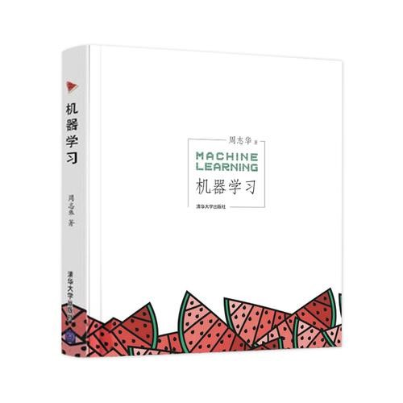

# 机器学习概论（专业核心）

<figure><figcaption>
课程教材
</figcaption></figure>

## 课程简介

本门课是大数据学院开设的为数不多的专业核心课程。课程内容基本围绕西瓜书展开，课程PPT也基本与西瓜书一致。以期中考试为界，前半部分（1-8章）主要讲授监督学习的方法，其中包括模型的评估、线性模型、决策树、支持向量机、贝叶斯分类器、基本的神经网络和集成模型；后半部分（9-14章）为无监督学习方法，主要讲授聚类、降维、特征选择与概率图模型（其中12章未讲授，13章简要讲授）；除此之外，还补充了概率图模型中的Topic Model（LDA算法），讲授了与之相关的变分推断和吉布斯采样方法，这一部分的数学思想比较深刻，理解有一定难度。

## 前置知识涉及的课程

概率论与数理统计，数据分析及实践（Python语言）、线性代数

## 往年经验

这门课具有一定量的数学推导，可以与南瓜书配合学习。考试的内容比较偏向数学（尤其是概率部分，例如考察分布的先验等），与课后习题的考察内容的形式方向类似（课后习题会涉及往年考题）。期中开卷，期末考试开卷（只携带纸质文档），考察内容会涉及到一些凸优化相关的基础的思想与算法，以及上课讲授的模型的计算如手算决策树、手算反向传播等。实验包括逻辑回归、Xgboost、聚类、LDA（较为复杂，但时间充裕，截止时间除夕夜）四个实验，需要一定的Python编程基础。讲授内容中的Topic Model部分可以在PRML上找到（相关内容占了3章），可以借鉴其中内容和课后习题，这一部分是期末考试的压轴题。

## 与后续课程的联系

AI相关研究的基础内容，为之后的深度学习导论打下基础。

## 课程资源



## 目录

机器学习概论教学大纲

绪论

模型评估与选择

线性模型

决策树

神经网络

支持向量机

贝叶斯分类器

集成学习

聚类

降维与度量学习

&#x20;特征选择与稀疏学习

概率图模型&#x20;

