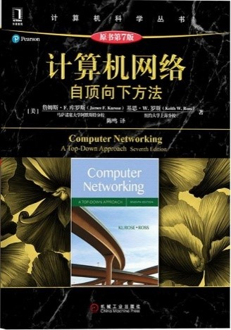

# 计算机网络（专业选修）

<figure><figcaption>
课程教材（计科班）
</figcaption></figure>

<figure><figcaption>
课程教材（信院班）
</figcaption></figure>

##

## 课程简介

本门课是计科开设的选修课，也可选择由信院开设的相同课程，往年两个院开设的课程都可计入大数据选修学分。主要方向是学习网络基本原理、协议、技术及应用的课程，包括网络分层体系结构模型、物理层至应用层各层主要设计问题、TCP/IP协议栈、常见网络应用、以及基本的网络安全技术。不同的老师在课程关注内容的偏重上有所不同，使用教材的版本也可能有所区别。作为往年大数据考研计算机方向的必考课程之一，推荐可能需要考研的同学以及感兴趣的同学选课。

## 前置知识涉及的课程

无

## 往年经验

本课程的重点在于基本概念的理解（记忆内容较多），而技巧性不强，建议认真听课以打好基础。作为偏文科的考试，做含有计算的题一定要足够细心，回答简答题时一定要足够详细，防止被扣分。

**自学强烈建议参考此网课，基本完全覆盖此课的知识点，且通俗直观易懂**

**【计算机网络微课堂（有字幕无背景音乐版）】**



## 与后续课程的联系

单就“课程”而言，作为大数据学院的选修课，本课程与大数据学院的后续课程的联系较少。但作为计算机专业的四大课程之一，本课程的地位仍然十分重要。在开发岗位工作中，计算机网络是重要的基础知识（亲测）；在科研中，计算机网络也是一个热门方向，且近年来与机器学习也有部分交叉。虽然是选修课，但这门课非常推荐大家学习。另外，作为考研408的其中一门必考科目，如果要考研计算机方向，也推荐选课先提前学习。

## 课程资源



## 目录

计算机网络教学大纲

什么是因特网

应用层

运输层

网络层

链路层

