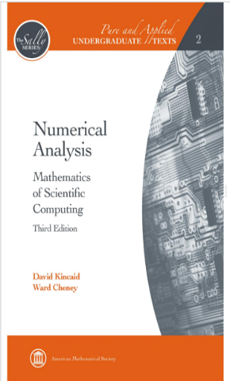

# 数值代数（专业选修）

<figure><figcaption>
课程教材
</figcaption></figure>

## 课程简介

本课程的主要内容包括：1.线性代数方程组的直接解法与迭代法2.最小二乘问题的数值方法3.特征值问题的计算方法。通过本课程的学习，希望学生掌握数值线性代数的基本内容和基本方法，对矩阵计算的最新动态有初步了解，能运用所学方法上机实算。有点类似计算方法的升级版

## 前置知识涉及的课程

数学分析，线性代数

## 往年经验

这门课以往由邓建松老师教授，教材为北大出版的《线性数值代数》，两个老师教授的内容有较大区别，需要注意区分。就内容上而言，陈先进老师的这门课主要教授利用数值方法解方程（组）的方法，知识上难度不大，只是需要注意对于工科的同学要注意各种定理的应用可能不止于解题，需要理解证明和拓展。

## 与后续课程的联系

> 林伟教授：我常常被问到，人工智能到底能不能够激发新数学的发展，这种新数学在做基础数学的人看来不一定是新的，但可能跟一些我们意想不到、不那么常用在智能领域的数学分支发生联系？
>
> 我对这个问题做了些思考，大概收集十个方向。首先，有四个部分知识大概是我们在人工智能领域里用得比较多的：
>
> * 一个是概率论、数理统计；
> * 一个是数值代数、数值分析、最优化；
> * 一个是经典分析、函数论，比如深度学习里很重要的一块是知道逼近论的知识；
> * 计算机科学基础，包括离散数学、理论计算机科学。

## 目录

数值代数教学大纲

线性代数方程组的直接解法与迭代法

最小二乘问题的数值方法

特征值问题的计算方法

