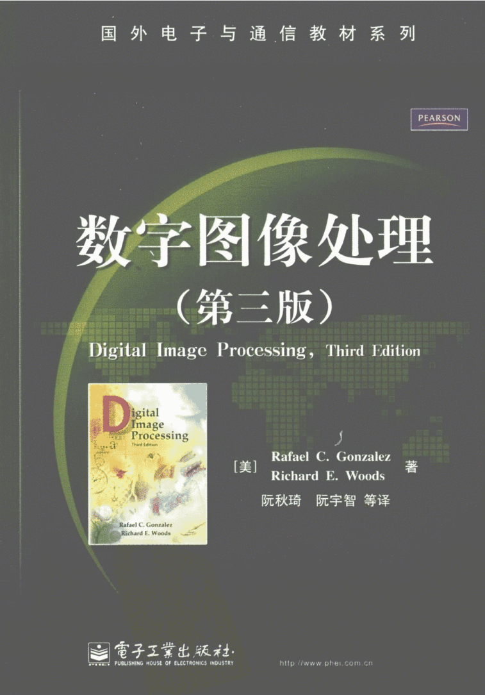

# 数字图像处理B (专业选修)

学分：2

课程教材：

<figure><figcaption></figcaption></figure>

### 课程简介

数字图像处理B由信息科学技术学院开设，人工智能专业同学可在3秋选修。教授的内容偏基础，主要是对图像信号的处理，比如在像素层面对图像进行各种操作、滤波或变换等，在课程的后半程也会涉及图像内容的一些基础特征，比如直线检测、边缘提取、孔洞填充、二值分割等，但对于图像中蕴含的更高级语义，如复杂形状识别、真实物体的提取、图像内容理解等，以及深度网络等技术则主要是在PPT简单带过，并无对应实验或较多深入。

### 前置知识涉及的课程

无

### 往年经验

课程整体难度不大，考核由平时分与期末考试组成。期末考试为10道简答题，每题约10分，闭卷，均从PPT中内容出题，主要考察概念与理解，考前建议至少过一遍PPT，加以记忆与整理则更佳。

平时分主要由编程实验组成，2025秋课堂一共七次实验，分别为：

1. 实现三种图像插值算法(最近邻、双线性、双三次)
2. 直方图均衡、空域滤波(均值滤波、中值滤波、图像锐化)
3. 雷登变换投影重建
4. 近似金字塔与预测残差金字塔(图像分辨率相关)；二维快速小波变换及边缘检测
5. 图像二值形态学(长字符提取、空洞填充、边界清楚)、图像灰度级形态学(顶帽变换、颗粒检测、纹理分割)
6. 基于霍夫变换的直线检测；阈值分割
7. 多光谱图像的贝叶斯分类器

以上内容仅供参考。每次实验DDL为一周或两周，迟交每天都有0.9倍得分惩罚。实验可使用MATLAB或python。每次实验均需要提交源代码、输出图像、以及实验报告，无硬性字数要求。偶有抽查点名作为平时分参考。

### 与后续课程的联系

传统视角看，这些底层信号处理的技术，是中层图像分析和高层图像理解的基础，也确实有其实用性、易用性与发挥重要角色的地方。但随着深度网络乃至多模态大模型技术等的发展与流行，各种模型也为同学们直接上手接触高级语义提供了不小的捷径，而并不刚需本门课程的内容作为计算机视觉等课程的硬性基础 (这些课程也确实未设预修要求)，并且我想这些课程也会在开课之初补充一定基础知识。

尽管如此，由于课程考试难度不大，且平时和图像打交道，能看见输入输出的视觉变化，相对有趣。如果感兴趣，仍然推荐修读，加深对图像信号与卷积滤波等的理解，也可以了解到许多数字图像相关的知识。若有志于多模态等方向，则建议同时也多多了解学习各种模型与新技术，两者相辅相成会有更好的效果。

### 课程资源

含25秋期末试题(回忆版)、中英教材、课件等，链接：链接：[https://pan.ustc.edu.cn/share/index/eb43ef2867114dd99367](https://pan.ustc.edu.cn/share/index/eb43ef2867114dd99367)

### 目录

课件PPT内容：

1. 绪论
2. 数字图像基础
3. 灰度变换与空域滤波
4. 频率域滤波
5. 图像复原与重建
6. 彩色图像处理
7. 小波和多分辨率处理
8. 图像压缩
9. 形态学图像处理
10. 图像分割
11. 表示和描述
12. 目标识别
