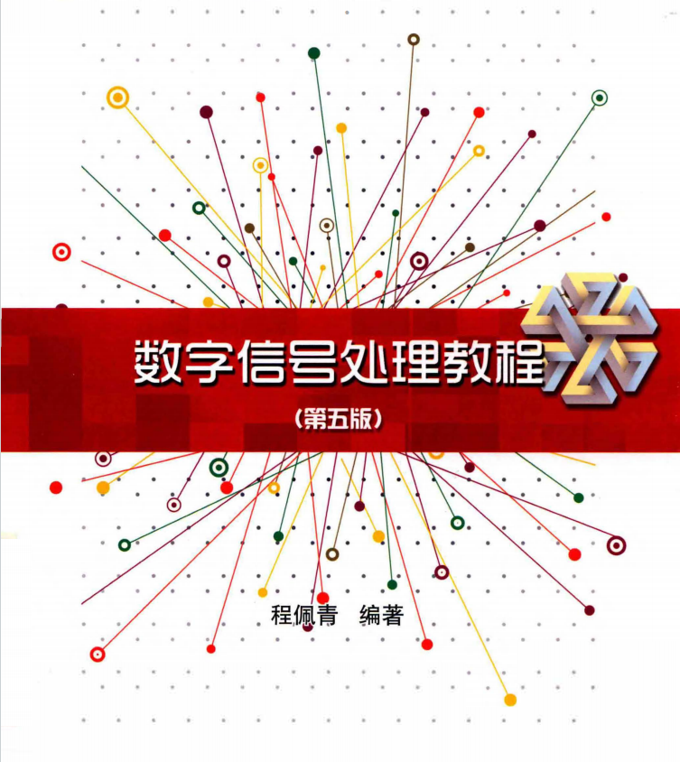

# 数字信号处理A

## 课程简介

本课程是 6 系（电子信息工程）大三上学期的专业课，也是电子信息工程考研必考科目之一，同时作为 AIDS 专业的选修课（不同年份培养方案可能有调整，请以本届培养方案为准），因此多数 AIDS 方向的同学不会接触到该课程。

考试形式方面，2025 年秋季及以前为半开卷，2026 年查询课程介绍时显示为闭卷（但也有可能实际采用半开卷形式）。

成绩由平时作业、实验和期末考试三部分构成。

## 前置课程

建议先完成**信号与系统** 及其前置课程的学习，这样学起来会轻松很多。当然，如果读者对自己的数学基础比较有信心，也可以直接学习本课程。

## 课程安排

教材为程佩青《数字信号处理教程》（第五版），具体以当年教务系统指定为准。课堂教学覆盖以下章节：

- 第一章：离散时间信号与系统
- 第二章：z 变换与离散时间傅里叶变换
- 第三章：DFT
- 第四章：FFT
- 第五章：数字滤波器的基本结构
- 第六、七章：IIR 和 FIR 数字滤波器（部分内容）

以数字信号处理 A（何力、尹华锐、陈晓辉）班级为例（笔者于去年在该班修读）：何力老师负责前三章，尹华锐老师负责第四、五章，陈晓辉老师负责第六、七章。

## 课程内容

前三章与**信号与系统 A** 重合度较高，主要是在其基础上的补充及部分定义的调整。如果信号与系统 A 学得比较好，这部分会很轻松。主要变化在于 DFS/DFT 部分的一些定义上调整、序列的圆周性质，以及对部分性质定理的深入讨论。

第四章主要讲快速傅里叶变换（FFT）。这部分在信号与系统 A 的教材中也有涉及，但通常老师会在那门课中跳过，留到本课程详细讲解。学习 FFT 的重点在于理解其原理和大体推导过程，以及按时间抽选或按频域抽选，输入正序或反序，输出正序或反序等等情况在 N=2、4、8、16 时的FFT/IFFT蝶形图。考试很可能出一道10分的大题，要求画蝶形图并进行简单计算（可参考教材，例如计算复数乘法和加法次数）。此外，4.7 节教材中打星号的复合数的 FFT 算法老师上课也会讲到；4.8 节 CZT 算法似乎是尹老师比较喜欢的考点，有空可以看看，但这类题目通常大家都看不太懂，实际上也没多少人能拿到多少分。

第五章内容大部分也与信号与系统 A 有重合，同时增加了一些新内容，整体难度不大。

第六章和第七章分别是 IIR 和 FIR 数字滤波器的设计。这两章题型非常固定，考试时对应的参数也会在试卷上给出，把课后作业和答案看懂并能独立完成，基本上就能拿到绝大部分分数。第六章主要是 Butterworth/切比雪夫（Butterworth 是重点，切比雪夫是否考取决于老师规定）的高通、低通、带通、带阻滤波器设计，使用冲激响应不变法或双线性变换法结合给定参数进行设计。第七章则是 FIR 的窗函数设计法和频率抽样设计法，个人感觉难度比第六章略大，涉及到的傅里叶逆变换也不太好算，需要多加注意。

总的来说，前三章如果信号与系统 A 掌握得较好或数学水平很强的话学起来没什么问题；第四章需要仔细研究一下；第五章整体上难度不高；第六、七章把公式搞明白、每种题型的题目都刷会之后基本上问题不大。

## 作业情况

每章布置一次作业，在 BB 系统上提交。作业题与往年重合度较高，如果遇到不会的题目可以参考往届作业。考前复习时，由于参考资料不是很多，建议重点复习一下考试题。

## 实验内容

实验共五次，安排在几个周六的上午。可以提前完成，选择其中几周到线下验收即可。实验使用 MATLAB 编写，任务量不算少。由于大多数同学在大一、大二阶段没有接触过该语言，编写代码可能会比较费劲，不过借助 AI 工具应该比较好做。最后要交一份完整的实验报告到 BB 系统。

## 考试内容

考试可能涉及一些信号与系统的基础内容（当然也是前三章涉及的），如果信号与系统学得不太好需要注意一下，还会考一些卷积和变换的计算，不会太难。基本上会有一道 FFT 相关的题目。然后有些年考过CZT可以复习的时候看一下。后面几道题均为第六、七章的套路题，按题型准备即可。

需要注意的是，如果考试改为闭卷，考试内容可能会发生改变。

## 参考资料

- [USTC_learning_materials](https://github.com/ly382965/USTC_learning_materials)(https://github.com/ly382965/USTC_learning_materials) 仓库中 `3FA DigitalSignal Processing` 目录，包含 2024 年的 DSP 实验报告和代码、课后习题答案以及部分期末试卷。
- 评课社区上也有一些分享，包含去年的考试题。

注：评课社区中本课程（数字信号处理A）与往年的「数字信号处理」是同一门课。
