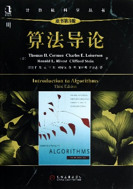

# 算法基础（专业核心）

<figure><figcaption></figcaption></figure>

##

## 课程简介

本门课是大数据与计科的大三同学一起上的学科群基础课。内容基本涵盖了算法导论的大部分内容，包括算法的基本概念，算法设计和分析的基本方法和技巧，以及高级数据结构和算法。基本内容包括排序、堆和优先队列、红黑树、平摊分析、二项堆、分离集合、分治法、动态规划、贪心法、快速傅立叶变换、图论算法、串匹配等。由于不同授课老师所授该课程均具有强烈的个人风格，讲述内容与形式各有侧重，这里笔者强烈建议左转评课社区研究选课。

## 前置知识涉及的课程

C语言，数据结构。

## 往年经验

不同老师授课的侧重点不同，要求也不一样，但笔者认为算法的重点在于应用（编程），不妨有时间的话多刷刷leetcode，一来提高自己的编程水平，二来对算法课程有一些深入地理解，三来对之后无论是找工作还是夏令营机试都有很好的帮助。期中期末考试不同班级不同老师差异巨大，但共同点是会抠一些算法或者数据结构的细节，具体内容可以左转评课社区查看，GitHub上也有往年的试卷和实验，请善用。一位大佬如是说道：“如果大家在上完这门课程之后了解到数据结构和算法两门课分开上的原因，可能也就对数据结构和算法有了很深入地认识”，大家在学习中也不妨思考这个问题，感受算法的奥妙所在。

## 与后续课程的联系

后续各种编程方法的基础，与各种领域如网络、系统、AI、通信等都联系紧密，也是程序员工作面试的必备技能（leetcode的知识基本全在本课程有所讲授）。

## 课程资源



## 目录

算法基础教学大纲

基础知识

排序和顺序统计量

数据结构

高级设计和分析技术

高级数据结构

图算法

算法问题选编

