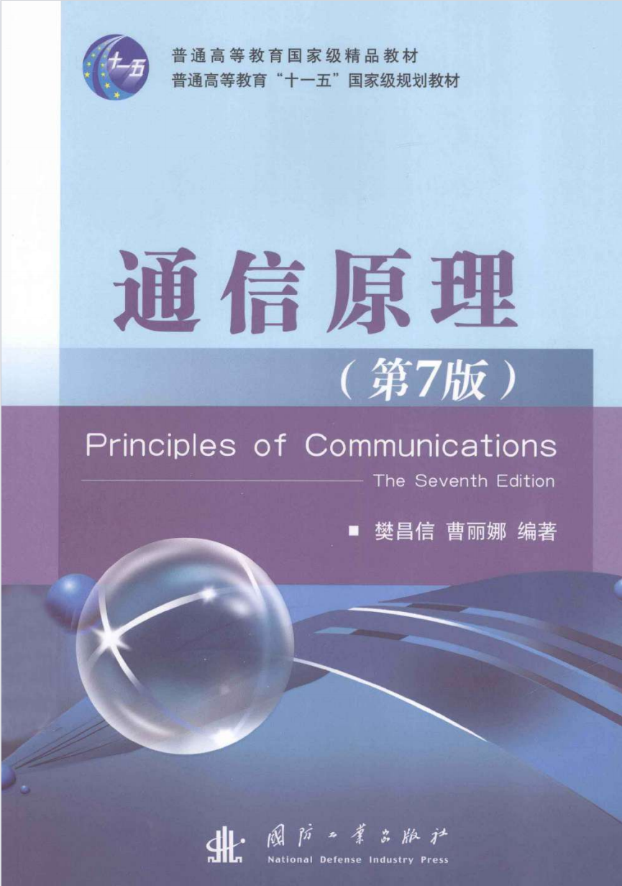

# 现代通信原理

by xgz

## 课程简介

本门课程为6系（电子信息工程）的专业必修课，以及AIDS专业的选修课程，因此如果不是必修的话不是很建议修读。教材目前使用通信原理（第7版） 第7版 樊昌信、曹丽娜 国防工业出版社，同样有一本对应的教辅材料（学习指导，作者同教材作者），里面有课后习题的答案以及一些知识讲解。课程总评包含平时成绩+实验成绩+期末考试成绩。2025年秋本课程未设置期中考试，但老师也有可能会设置期中考试，本课程可能没有补考。

## 前置课程

信号与系统A；随机过程

## 课程内容解析

本门课程涉及教材1-13章（即整本书），其中主要部分集中在4-11章，具体需要掌握的内容由课程老师决定。

第一章主要介绍一些基本定义，包括信息量、信道、调制等。第二章和第三章分别是信号与系统、随机过程的回顾，如果这两门课掌握得较好，基本上没有问题。

从第四章开始进入本门课程的主线，后续内容清晰地介绍了一个信号如何经过调制通过信道到达接收方，接收方再将已调信号解调，恢复出原始信号的过程。按照理想情况，信号完全可以直接传输给对方，没有必要这么复杂。但在现实中，首先信号经过信道时可能会有一定的损失或错误，因此需要选取合适的信道；其次，信号在传播途中容易受到噪声的干扰，所以需要通过调制使信号与噪声尽量区分开，而这里信号的信息量和噪声带来的影响，通常用信噪比来衡量。

在有了以上了解后，我们首先学习信道，了解信道类型、信道对信息传输的影响、噪声的影响（为简化学习，通常默认噪声为高斯白噪声），以及如何一次传输更多信息（信道容量），这就是第四章的内容。

后续章节中，我们学习信号的调制，包括模拟信号的调制（第5章）和数字信号的调制（第6-8章）。第九章是关于数字信号接收的内容，主要讨论如何更好地接收信号以获得更优的最终信息（这部分内容大多是对前面内容的总结）。

从章节安排可以看出，数字信号的占比远多于模拟信号。模拟信号通常也需要转换为数字信号，因此第十章讲解**信源编码**，包括模拟信号的抽样、量化、编码，以及语音、图像、数字数据的编码方式。数据结构中学过的Huffman编码也是数据压缩中经典的编码方式之一。

在传输过程中，由于可能受到噪声等影响，接收方收到的信息可能会出现错误，因此需要利用**信道编码**增强编码的鲁棒性。第十一章介绍了一系列信道编码，例如在计算机网络中也会学到的CRC编码，它可以在接收时检测传输过程中是否出现错码，并据此进行纠错。

需要注意的是，信源编码一般是进行压缩，提高传输效率，信道编码一般是为了提高传输可靠性。

第十二章和第十三章分别为正交编码与伪随机序列、同步原理，但由于笔者所上课程中并不是重点，因此笔者在此不过多陈述。

## 实验内容

实验使用Matlab作为编程语言，到实验室进行实验，一共几次实验，实验分别会在示波器上观察波形和在电脑上进行仿真，最终找老师或助教进行验收并回答提问的一两个问题即可。此外，有一个最终选做的大作业，但据说很不好做而且加分不多，所以不太建议占用期末复习的时间来完成。

## 考试内容

本门课程考试题目类型在评课社区有一些体现，可以说每个部分都有可能会考到。考试分为简答题和大题，大题有很多分为好几个小问，考的内容都会比较细，因此需要对书中每个细节都掌握的比较好。考试难度很大，大家可能分数都不是很高，因此会有较大程度的调分。

## 参考资料

本门课程参考资料较少，笔者未找到往年真题，因此是通过看书、做书后习题和看那本教辅来进行复习的，课程内容比较多和杂，建议大家把书里的内容都仔细看完并记住。
