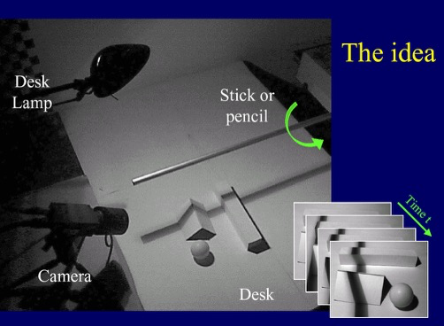

# 计算机视觉课程介绍

23级自动化系刘环鸣，lhm_0410@mail.ustc.edu.cn。本文为25秋课程经验，仅供参考。

## 课程概述

本课程围绕较为传统的计算机视觉内容展开。内容主线可概括为：

**Image Processing → Representation → Reorganization → Reconstruction → Recognition**

课程几乎不需要前置知识。可以简单了解一下信号与系统、数字图像处理、机器学习等相关内容。

---

## 课程安排

| 日期 | 课时 | 内容 |
|---|---:|---|
| 09.12 | 3 lectures | Introduction |
| 09.19 | 3 lectures | Recall: Image Processing I |
| 09.26 | 3 lectures | Recall: Image Processing II |
| 10.03 | 3 lectures | Representation I |
| 10.10 | 3 lectures | Representation II |
| 10.17 | 3 lectures | Representation III |
| 10.24 | 3 lectures | Reorganization I |
| 10.31 | 3 lectures | Reorganization II |
| 11.07 | 3 lectures | Reconstruction I |
| 11.14 | 3 lectures | Reconstruction II |
| 11.21 | 3 lectures | Recognition I |
| 11.28 | 3 lectures | Recognition II |
| 12.05 | 3 lectures | Recognition III |
| 12.12 | 1 lecture | Final Report |

---

## 考核方式

课程提供 5 个 project，三人一组，选两道题完成。25 秋截止日期为 12 月 20 日 24:00，约第十五周。

### 报告内容要求

1. 报告内容需包含：

   1) 摘要（简述所做项目及主要方法）

   2) 研究现状及主要研究方法

   3) 本文研究方法（分步描述）

   4) 实验结果

   5) 总结（优势及不足）

   6) 参考文献

2. 报告使用附件提供的word或者latex模板（用word模板的需要转pdf提交）。

3. 评分以各项目相对难度及完成程度，报告内容是否充实等为主要依据。

4. 附件包括：
   1. 项目报告
   2. 源代码，并且源代码中要包含中间结果，使用说明。

### 25秋题目如下：

#### Project1: 基于图像引导滤波的自然抠图

要求：

1. 设计算法实现对project_1中的图像实现自然抠图。
2. 报告应包括基本理论、算法步骤及中间结果。如对原算法有改进创新，应重点说明。
3. 报告中展示主观和客观结果，以及相应的实验结果分析（根据设计的算法，分析中间步骤不同设计对结果的影响等）。

相关指标：https://blog.csdn.net/qq_41731861/article/details/121922224

#### Project2: 基于SIFT特征的多视角图像拼接

要求：

1. 采用SIFT算法实现对project_2中的图像实现图像拼接。
2. 报告应包括基本理论、算法步骤及中间结果。如对原算法有改进创新，应重点说明。
3. 报告中展示图像拼接后的结果，以及相应的算法分析（例如运行时间，参数选择对实验结果的影响，特征点选择、特征点匹配的可视化结果分析）。

#### Project3: mean-shift 图像分割

要求：

1. 采用mean-shift算法实现project_3中的图像分割。
2. 报告应包括基本理论、算法步骤及中间结果。如对原算法有改进创新，应重点说明。
3. 报告中展示图像分割后的结果，以及相应的算法分析。

#### Project4: 阴影3D重建

<figure>
  
  <figcaption>
Project 4 阴影三维重建实验装置
</figcaption>
</figure>

要求：

1. 搭建如图所示系统，拍摄某一物体的系列阴影图像（也可拍摄视频）做为输入数据；
2. 基于阴影三维重建方法估计物体三维点云数据；
3. 利用三维显示软件(例如Blender)对物体进行三维重建；
4. 更多信息见project4.ppt，参考文献见3D_photography_on_your_desk.pdf

#### Project5: 基于Zero-Shot Learning的显著性检测

要求：

1. 复现论文[《Learning to Promote Saliency Detectors》](https://openaccess.thecvf.com/content_cvpr_2018/papers/Zeng_Learning_to_Promote_CVPR_2018_paper.pdf)中的方法通过Zero-Shot Learning实现显著性检测。
2. 报告应包括算法步骤，如对原算法有改进创新，应重点说明。
3. 报告展示在[ECSSD数据集](https://www.cse.cuhk.edu.hk/leojia/projects/hsaliency/dataset.html)上的相关指标，并且展示若干效果图。

## 备注

曹老师人非常好，学术水平很强，课程要求比较宽松。本课程不点名，并在第一节课给出课程计划，可以按兴趣选择听课。想学知识可以来认真听课，想拿学分刷绩点可以认真搞搞 Project。在已经学习过机器学习、深度学习，并合理使用 coding agent 辅助实现的情况下，课程 Project 的整体难度较低，工作量也较小，三人合作 4-5 个小时即可完成两道 Project。这门课唯一的缺点是讲的内容偏传统，如果想了解更前沿的计算机视觉，推荐学习 [Stanford CS231n: Deep Learning for Computer Vision](https://www.youtube.com/watch?v=2fq9wYslV0A&list=PLoROMvodv4rOmsNzYBMe0gJY2XS8AQg16) 并完成课程的 [assignments](https://cs231n.stanford.edu/assignments.html)。
