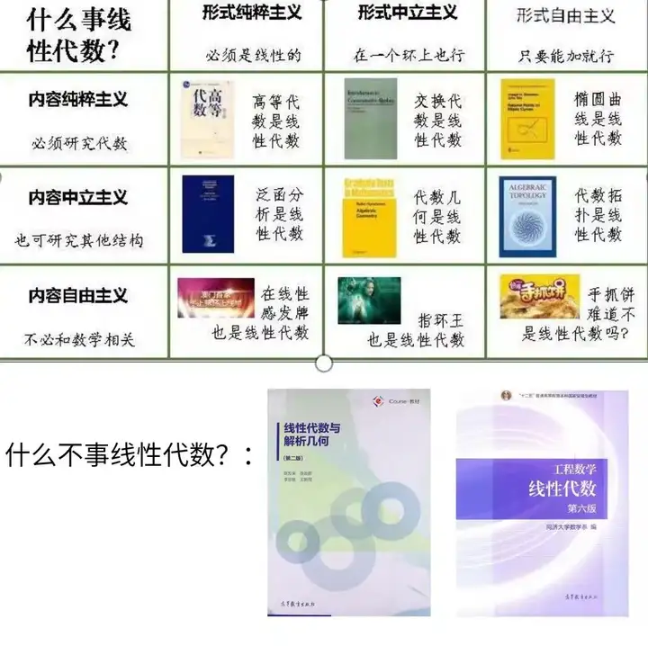

# 线性代数（数学通修）

> 其实很多同学上完这门课之后, 过一两年可能什么都不记得了, 只记得怎么解线性方程组。
>
> ——中科大侯新民老师

## 什么是线性代数?

<figure><figcaption></figcaption></figure>

### 线性方程组与矩阵

线性代数起源于对线性方程组的求解, 当时的人们希望能够找到一个优雅的公式, 就像一元二次方程的求根公式一样.

具体而言, 对于方程:

$$
\begin{cases}
a_{11}\cdot x_{11}+a_{12}\cdot x_{12}+...+a_{1, n}\cdot x_{1, n} = b_1  \\
a_{21}\cdot x_{21}+a_{22}\cdot x_{22}+...+a_{2, n}\cdot x_{2, n} = b_2  \\
... \\
a_{m1}\cdot x_{m1}+a_{m2}\cdot x_{m2}+...+a_{m, n}\cdot x_{m, n} = b_m 
\end{cases}
\text{其中x为变量, a, b为系数}
$$

有几个问题需要考虑:

1. 解(使得方程成立的x)是否总存在? 如果不是, 那么什么时候(或者说a, b满足什么条件)存在? 什么时候不存在?
2. 解是否总是唯一? 如果不是, 那么什么时候唯一? 同组方程不同解之间有什么关系?

对于上述问题的研究催生了矩阵和行列式的发现, 大家发现, 对于一个方程, 我们只用考虑他的系数, 于是视图用一个更方便的方式来表达系数:

$$
A = \begin{pmatrix} a_{11} & a_{12} &...&a_{1n} \\ a_{21} & a_{22} &...&a_{2n} \\... \\a_{m1} & a_{m2} &...&a_{mn} \end{pmatrix}, b = \begin{pmatrix}b_1 \\ b_2 \\ ... \\b_m \end{pmatrix}
$$

这样就有了矩阵。通过研究矩阵A的性质, 以及A和b的关系, 就能得到上面两个问题的答案。并且后续人们对矩阵进行了更深入的研究， 并不止步于线性方程组。

### 线性空间

当然， 如果仅仅是研究线性方程组和矩阵， 这样的一门课似乎被称为线性代数并不合适。实际上， 本课程会介绍一个重要的概念：线性空间。

线性空间当然有着严格的定义， 不过在此我们并不引入， 可以姑且认为只要一个东西满足可以相加， 可以乘一个数字，并且运算符合你的直觉， 那么它就是线性的。

读者可能觉得上面很废话文学？一瞬间涌上脑子里的东西都是满足上面这些条件的， 比如

1. 三角函数：$$\sin x, \sin 2x, ..., \sin nx, ..., \cos x,  \cos 2x, ..., \cos nx, ...$$
2. 多项式: $$x, x^2, ..., x^n$$

事实也几乎确实如此, 毕竟'everything is linear if you are brave enough'. 一些最勇敢， 或者说最疯狂的人， 他们甚至想到了把你看到的一个个单词也变成线性的。一个最简单的方法就是打开词典， 一个单词一个单词编号， 这样每个单词都对应了一个数字， 于是一句话就变成了一个向量(或者说矩阵, 在机器学习中通常不做区分, 实际上他们长的也差不多)， 得到的结果叫token。

例如, "hello ustc, I'll love you forever!"这句话, 通过类似上面的操作, 就变成了:

$$
\begin{pmatrix}24912, 19178, 66, 0, 17291, 3047, 481, 22264, 0\end{pmatrix}
$$

这些数字进一步被转化为向量(word embeddings), 成为了现在最强大的人工智能的基础。

> 这个结果来自于[https://gpt-tokenizer.dev/](https://gpt-tokenizer.dev/), 感兴趣的同学可以自己尝试。有同学可能注意到上面的单词数量和下面的数字数量并不是严格对应， 这是因为ustc被拆成了两个单词, 而'!'也被识别为一个独立的单词。

## 线性代数有什么用？

相信通过上面的例子, 你已经知道线性代数在人工智能方面的应用, 不过笔者还是希望介绍几个其他的例子。

### 1. 图像处理

如果你了解绘画或者摄影相关的知识, 那么你可能知道, RGB三原色, 即每一种颜色都可以用红色, 绿色, 蓝色三种颜色相加得到. 既然是加法, 你可能会想到线性代数, 事实也确实如此, 不过我们在此不过多深入。&#x20;

图像是由一个个像素构成的，每一个像素有红绿蓝三种属性， 那整个图像就是3个矩阵， 每个矩阵分别表示红绿蓝。这样， 对矩阵的操作就是对图像的操作： 比如， 如果我们能压缩矩阵，那就能压缩图像！

### 2. 数据科学

人工智能与数据科学学院进阶指南必须要谈数据科学！

假如说我们有这样两行数据， 一行表示工人年龄， 一行表示工人薪资。

| 王二  | 张三  | 赵四  |
| --- | --- | --- |
| 20岁 | 30岁 | 35岁 |
| 10万 | 17万 | 20万 |

这可以表示为一个矩阵：

$$
\begin{pmatrix} 20 & 30 &35  \\10 & 17 & 20 \end{pmatrix}
$$

这样， 对矩阵之间行是否相关的分析就变成了对数据之间是否相关的分析。

## 怎么学好线性代数

本课程曾经的教材是由陈发来教授主编的“线性代数与解析几何第二版”， 2024年春开始使用打印讲义(据说要出版不过一直没出)，也并没有做太大调整。

<figure><figcaption></figcaption></figure>

虽然曾经的教材叫这个， 不过老师上课时都会跳过前两章，直接上线性方程组。接着依次介绍矩阵，行列式，线性空间，至此为期中考试；期末考察剩下三章：线性变换，欧氏空间，二次型。

### 对于考试

考试计算量偏大，但是题型，考点固定。往年题的资源也非常丰富，针对往年题进行复习即可。

### 对于线性代数

如果你希望对线性代数有一个更加深入的理解，而不是局限于课堂和考试的话， 这门课程有非常多的资料。笔者在此仅列举一二：

#### 课程MIT18.06+教材Introduction to Linear Algebra

Gilbert Strang 老先生年逾古稀仍坚持授课， 他和他的课程应该是线性代数领域知名度最高的，同时教材Introduction to Linear Algebra据说也是清华的线代教材。课程在b站有翻译版，教材也可以在图书馆借到。

优点：太多了说不过来

缺点：教材是英文版，对于部分同学可能有障碍(实际上还好， 另外据说有了翻译版，不过我没找到)

#### 3Blue1Brown: 线性代数的本质

比起课程更像严肃科普，尝试从几何变换的角度讲解线性代数的一些操作，视频中动画很丰富，能给大家几何直观。

<figure><figcaption></figcaption></figure>

优点：很直观， 角度比起课堂上的更新颖。

缺点：只看这个容易浮于表面，建议作为补充材料而不是主导。

